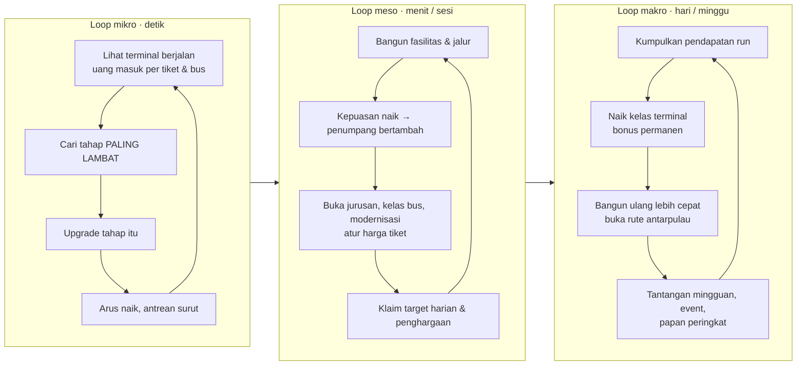
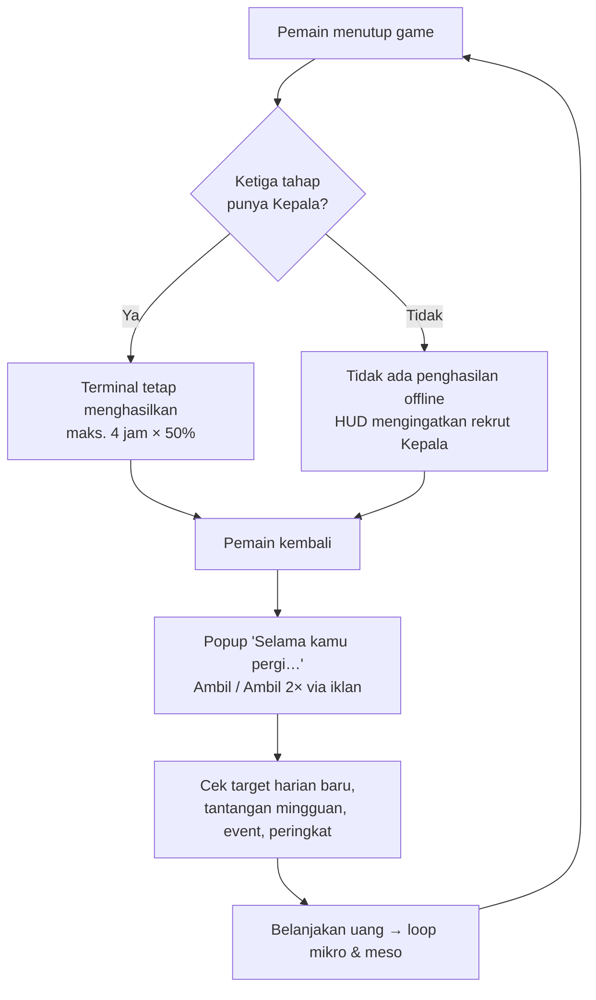

# 03 · Core Gameplay Loop

Aktivitas pemain dari mulai bermain, berkembang, sampai kembali bermain. Mekanik rinci ada di [02 · GDD](02-game-design-document.md).

## 1. Ringkasan tiga lapis loop

## 2. Loop mikro (detik-ke-detik)

| Langkah | Yang dilakukan pemain | Yang dilihat |
|---|---|---|
| 1. Amati | Melihat adegan 3D & HUD | Antrean menumpuk di depan tahap bertanda "⚠ PALING LAMBAT"; "+Rp" muncul di loket & pangkalan; "Hari ini Rp X · N tiket" bertambah |
| 2. Putuskan | Membandingkan biaya upgrade dengan uang | Tombol upgrade menyala hijau bila terjangkau; chip ringkas memberi panah hijau |
| 3. Bertindak | Mengetuk Upgrade pada tahap paling lambat | Level naik, kapasitas & label "Lv" berubah, bottleneck bisa berpindah |
| 4. Hadiah | Arus naik | Antrean di depan tahap itu surut, bus & penumpang lebih ramai, uang masuk lebih cepat |

Aktivitas sampingan di loop mikro:

- ketuk bus untuk klakson **telolet**;
- geser, zoom, dan putar kamera;
- ketuk **Bus Emas** saat lewat (bila iklan tersedia).

## 3. Loop meso (menit / satu sesi)

1. **Perluas kemampuan terminal**:
   - rekrut Kepala di ketiga tahap (pendapatan offline);
   - bangun Jalur 2–5 (kapasitas Peron & Keberangkatan +40% per jalur);
   - beli modernisasi.
2. **Jaga kepuasan**: seimbangkan kapasitas antartahap, naikkan Kios & Toilet sesuai arus, dan tambah jalur. Kepuasan tinggi memberi lebih banyak penumpang dan bonus pendapatan.
3. **Naikkan nilai tiket**:
   - buka jurusan berikutnya (tiket +10% s.d. +50%; PO kotanya ikut bergabung);
   - datangkan kelas bus baru;
   - kontrak PO;
   - atur harga per jurusan & kelas dengan bantuan tombol **Saran**.
4. **Tambah sumber uang**: Kios (sewa harian), Parkir Kendaraan, Parkir Bus Jurusan.
5. **Klaim hadiah kecil**: target harian (tiap 24 menit main) dan penghargaan (lencana merah di tab Target), opsional 2× lewat iklan.

Satu sesi khas (5–15 menit): ambil penghasilan offline → beberapa upgrade bottleneck → satu pembelian besar (jurusan/fasilitas/jalur) → klaim target → tutup.

## 4. Loop makro (hari / minggu nyata)

1. **Naik kelas terminal**: setelah pendapatan run cukup (3 poin = Rp 900 rb untuk Tipe C → B), pemain membangun ulang terminal dengan +10% pendapatan permanen per poin. Kelas baru membuka:
   - Tipe B: rute antarpulau Lampung & Palembang, kelas bus Sleeper;
   - Tipe A: Double Decker dan rute antarpulau berikutnya;
   - tampilan gapura baru dan PO hadiah.
2. **Tantangan mingguan** (Senin WIB): tiga tantangan yang sama untuk semua pemain, hadiah 15 menit pendapatan.
3. **Papan peringkat mingguan**: bersaing jumlah penumpang minggu ini.
4. **Event musiman**: Mudik Lebaran, HUT RI, dan Nataru menaikkan pendapatan dan memberi target bertahap dengan PO eksklusif.
5. **Koleksi jangka panjang**: 20 mitra PO beserta livery-nya, 18 penghargaan, rekor harian, dan rute sampai Banda Aceh.

## 5. Loop kembali bermain (retensi)

Pengait untuk kembali:

| Pengait | Kapan terasa |
|---|---|
| Penghasilan offline (maks. 4 jam) | Kembali tiap ±4 jam memaksimalkan hasil |
| Boost 2× yang tetap berjalan saat offline | Setelah menonton iklan sebelum pergi |
| Target harian baru | Tiap hari terminal (24 menit main) |
| Tantangan & papan peringkat baru | Tiap Senin 00.00 WIB |
| Event musiman | Sesuai kalender (Lebaran, Agustus, Desember) |
| Hadiah yang belum diklaim | Lencana merah di tab Target / titik merah tombol panel |
| Pembaruan versi | Popup "Versi baru tersedia" berisi catatan "Yang baru" |

## 6. Kurva sesi pertama (tutorial)

| Menit | Kejadian |
|---|---|
| 0 | Sambutan tutorial; terminal sudah berjalan, uang masuk Rp 5 per tiket (±0,8 penumpang/detik) |
| < 1 | Langkah 1: upgrade Loket (paling lambat) |
| ±1 | Langkah 2: rekrut Kepala Peron (Rp 50, terjangkau dalam ±10 detik) |
| 2–4 | Langkah 3: bangun Kios & Minimarket (Rp 80); toko di adegan buka |
| 4–6 | Langkah 4: bangun Jalur 2 (Rp 300); bus tidak lagi antre di jalan raya |
| ±5 | Greedy murni mencapai ±134 pembelian (Peron 43 / Loket 49 / Keberangkatan 44) |
| ±24 | Hari terminal pertama berakhir; sewa kios dibayar; target harian berganti |

## 7. Umpan balik per aksi

| Aksi | Umpan balik langsung |
|---|---|
| Upgrade tahap | Angka kapasitas & level; bottleneck pindah; antrean berubah |
| Rekrut Kepala | Lencana "K" di label tahap & "✓ Ada Kepala" di kartu |
| Bangun fasilitas | Petugas & toko muncul di adegan; "+Rp" di lokasi baru |
| Bangun jalur | Palang halte dibuka; notifikasi "🚧 Jalur N dibuka!" |
| Buka jurusan | Jendela loket baru dibuka, papan kota, pengumuman jurusan baru, PO bergabung |
| Ubah harga | Peminat & kursi terisi per baris; tanda merah bila terlalu mahal; kepuasan HUD berubah |
| Naik kelas | Popup konfirmasi; papan gapura berganti; notifikasi |
| Klaim hadiah | Uang bertambah; lencana berkurang |
