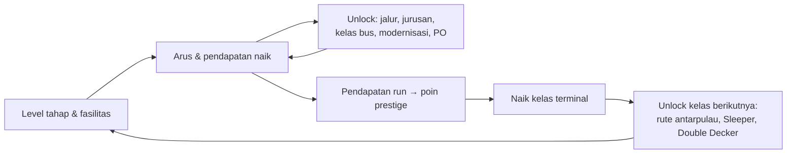

# 06 · Player Progression Design

Level, unlock, naik kelas, penghargaan, dan peringkat. Angka biaya ada di [05 · Game Economy Design](05-game-economy-design.md).

## 1. Sumbu progres

Bustation tidak memakai XP atau level pemain. Progres diukur dari terminalnya. Padanan istilah umum:

| Istilah umum | Padanan di Bustation |
|---|---|
| Level pemain | **Kelas terminal**: Tipe C → Tipe B → Tipe A → Terpadu ★1, ★2, … |
| XP | **Pendapatan run** (total uang sejak naik kelas terakhir) → poin prestige |
| Level item | Level tiap tahap (tanpa batas), level fasilitas (tanpa batas) |
| Unlock | Jurusan, jalur, kelas bus, modernisasi, mitra PO, fitur per kelas terminal |
| Achievement | 18 **penghargaan** |
| Ranking | **Papan peringkat mingguan** (penumpang minggu ini) |
| Koleksi | 20 mitra PO beserta livery-nya, 16 jurusan |

## 2. Level tahap

- Level 1 sampai tanpa batas, biaya naik eksponensial (r 1,08–1,09).
- **Milestone** di level 25, 50, 100, dan 200: kapasitas tahap ×2. Kartu tahap menampilkan "Lv 25: kapasitas ×2" dan bilah kemajuan menuju milestone berikutnya.
- Bottleneck berpindah-pindah, jadi pemain naik bergiliran di ketiga tahap.
- Penghargaan: "Terminal Megah" (semua tahap Lv 25), "Terminal Raksasa" (semua tahap Lv 100).

## 3. Urutan unlock dalam satu run (khas)

| Urutan | Unlock | Biaya | Membuka / efek |
|---|---|---|---|
| 1 | Upgrade tahap pertama | Rp 15 | Bottleneck berpindah |
| 2 | Kepala tahap (3×) | Rp 50 / 150 / 400 | Penghasilan offline |
| 3 | Kios & Minimarket Lv 1 | Rp 80 | Sewa harian; toko di adegan buka |
| 4 | Jalur 2 | Rp 300 | Tujuan akhir tutorial; bus tidak lagi antre di jalan raya |
| 5 | Mesin tiket, Marka halte, Jadwal digital | Rp 1,5 rb – 5 rb | Modernisasi tingkat 1 |
| 6 | Semarang, Yogyakarta | Rp 2 rb, 12 rb | PO Lumpia Kilat & Bakpia Rasa bergabung |
| 7 | Kontrak PO Ondel-Ondel | Rp 5 rb | +3% tiket |
| 8 | Jalur 3, Patas AC | Rp 25 rb | |
| 9 | Solo, Surabaya, Peuyeum Kilat, Tiket online, Pengatur bus, Gate e-boarding | Rp 70 rb – 400 rb | |
| 10 | Eksekutif, Jalur 4, Malang, Telolet Jaya | Rp 750 rb – 3 jt | |
| 11 | Denpasar, Jalur 5, Sultan Garasi | Rp 15 jt – 80 jt | Semua jurusan Jawa–Bali |
| 12 | Naik kelas → Tipe B | Pendapatan run ≥ Rp 900 rb | Lihat bagian 4 |

Urutan nyata bergantung pada pilihan pemain. Semua kecuali tahap & fasilitas berurutan dalam jenisnya (jalur, jurusan, kelas bus, modernisasi tingkat 2).

## 4. Kelas terminal (prestige)

| Kelas | Syarat (poin dari run) | Membuka | Hadiah & tampilan |
|---|---|---|---|
| **Tipe C** | Awal | 8 jurusan Jawa–Bali, kelas Ekonomi–Eksekutif | Papan gapura abu-abu "TERMINAL TIPE C" |
| **Tipe B** | 3 poin (run ≥ Rp 900 rb) | Rute antarpulau Lampung & Palembang; kelas bus Sleeper | PO Juara Kelas; penghargaan "Naik Kelas"; papan biru; umbul-umbul di median |
| **Tipe A** | 8 poin (run ≥ Rp 6,4 jt) | Mataram, Jambi, Padang; Double Decker | PO Juara Umum; penghargaan "Terminal Tipe A"; papan gelap bertulisan emas; lampu hias menyala malam |
| **Terpadu ★1** | 15 poin (run ≥ Rp 22,5 jt) | Bima, Medan, Banda Aceh | Papan cokelat emas "TERMINAL TERPADU"; bintang emas di gapura |
| **Terpadu ★n** | +10 poin tiap kelas | – | Bintang bertambah (maks. 5 ditampilkan) |

**Saat naik kelas**:

| Direset | Tetap |
|---|---|
| Uang (→ Rp 20), level & Kepala tahap, fasilitas, jalur (→ 1), jurusan (→ Jakarta & Bandung), modernisasi, kelas bus (→ Ekonomi) | Poin prestige (+10% pendapatan per poin), mitra PO, penghargaan, statistik total, nama terminal, rekor, tantangan mingguan & skor peringkat minggu ini, pengaturan harga tiket, pilihan ikut papan peringkat |

- Target harian penumpang yang belum selesai dihitung ulang untuk terminal baru.
- Naik kelas selalu lewat popup konfirmasi. Popup itu menyebut poin yang didapat, bonus baru, PO hadiah, dan kelas bus yang terbuka.
- Notifikasi muncul saat terminal siap naik kelas dan setelah naik.

## 5. Penghargaan (18)

Tercatat otomatis tiap tick. Masing-masing berhadiah **3 menit pendapatan** (2× lewat iklan). Jumlah yang siap diklaim tampil sebagai lencana merah di tab Target.

| # | Nama | Syarat |
|---|---|---|
| 1 | Manajemen Profesional | Rekrut Kepala pertama |
| 2 | Terminal Nyaman | Bangun fasilitas pertama |
| 3 | Berjalan Sendiri | Ketiga tahap punya Kepala |
| 4 | Tepat Sasaran | Selesaikan target harian pertama |
| 5 | Terminal Megah | Semua tahap Lv 25 |
| 6 | Seratus Ribu Perjalanan | Berangkatkan 100.000 penumpang (total) |
| 7 | Sepekan Beroperasi | Beroperasi 7 hari terminal |
| 8 | Fasilitas Lengkap | Semua fasilitas Lv 10 |
| 9 | Lima Jalur | Semua jalur bus beroperasi |
| 10 | Penghubung Jawa–Bali | Buka semua jurusan sampai Denpasar |
| 11 | Menyeberang Pulau | Buka rute antarpulau pertama |
| 12 | Naik Kelas | Terminal naik ke Tipe B |
| 13 | Terminal Modern | Pasang semua modernisasi |
| 14 | Terminal Raksasa | Semua tahap Lv 100 |
| 15 | Terminal Tipe A | Terminal naik ke Tipe A |
| 16 | Armada Lengkap | Kelima kelas bus beroperasi |
| 17 | Sepuluh Juta Perjalanan | Berangkatkan 10 juta penumpang |
| 18 | Lintas Nusantara | Buka semua rute sampai Banda Aceh |

## 6. Tujuan berkala

| Sistem | Siklus | Isi | Hadiah |
|---|---|---|---|
| Target harian | Hari terminal (24 menit main) | Bergantian "10 upgrade tahap" & "berangkatkan N penumpang" (N = ½ arus potensial × 24 jam terminal) | 2 menit pendapatan |
| Tantangan mingguan | Minggu WIB (Senin 00.00) | 3 dari 5 jenis, sama untuk semua pemain | 15 menit pendapatan per tantangan |
| Event musiman | Kalender WIB | 3 tahap target penumpang (arus × 20 menit / 1 jam / 3 jam main) | 5/15/30 menit + PO eksklusif |
| Rekor terminal | Hari terminal | Rekor penumpang & pendapatan sehari, arus tertinggi | Notifikasi "🏅 Rekor baru" |

## 7. Peringkat

- **Papan peringkat mingguan**: skor = penumpang yang diberangkatkan minggu ini (main aktif, arus nyata). Reset Senin 00.00 WIB.
  - Tampil 50 teratas: nama terminal, tipe terminal, skor.
  - Peringkat sendiri dihitung sampai 1.000. Di luar itu tampil "di luar 1.000 besar".
  - Tab Minggu lalu menampilkan hasil akhir.
- **Syarat ikut**: login Google, setuju tampil publik, dan nama terminal layak.
- **Tidak ada hadiah gameplay.** Peringkat murni gengsi, supaya kecurangan tidak merusak ekonomi.

## 8. Koleksi

| Koleksi | Jumlah | Cara mendapat |
|---|---|---|
| Mitra PO | 20 | 11 bersama jurusan, 4 kontrak, 2 naik kelas, 3 event |
| Livery bus | Sebanyak PO yang bergabung | Bus terminal yang muncul memakai livery PO (bobot 2 per PO) |
| Jurusan | 16 | Dibuka berurutan per run |
| Kelas bus | 5 | Per run, sebagian butuh kelas terminal |
| Tampilan gapura | 4 bentuk + bintang | Kelas terminal |

## 9. Kurva motivasi

| Fase pemain | Fokus | Penggerak |
|---|---|---|
| Sesi pertama (0–30 menit) | Tutorial, bottleneck, Kepala, Jalur 2 | Umpan balik visual cepat; uang awal cukup untuk upgrade pertama |
| Hari 1–3 | Jurusan Jawa–Bali, fasilitas, kepuasan, harga tiket | Target harian, penghargaan awal, PO kota |
| Minggu 1 | Naik ke Tipe B/A, rute antarpulau pertama | Prestige, tantangan mingguan, papan peringkat |
| Jangka panjang | Terpadu ★n, Banda Aceh, koleksi PO, rekor | Event musiman, peringkat mingguan, penghargaan langka (10 juta penumpang, Lintas Nusantara) |

> Perkiraan durasi per fase belum diukur dengan data pemain. Pakai `ringkasan_sesi` dan corong di GA4 untuk menyesuaikan `EKONOMI.kelas`, biaya jurusan, dan hadiah.
