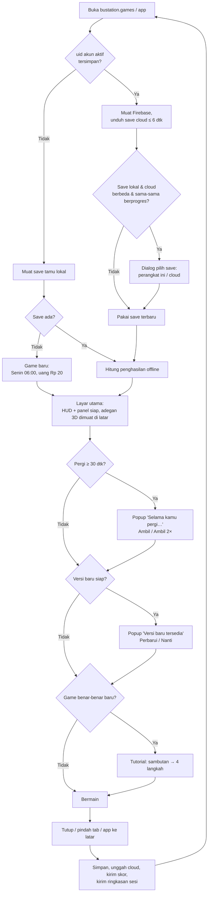
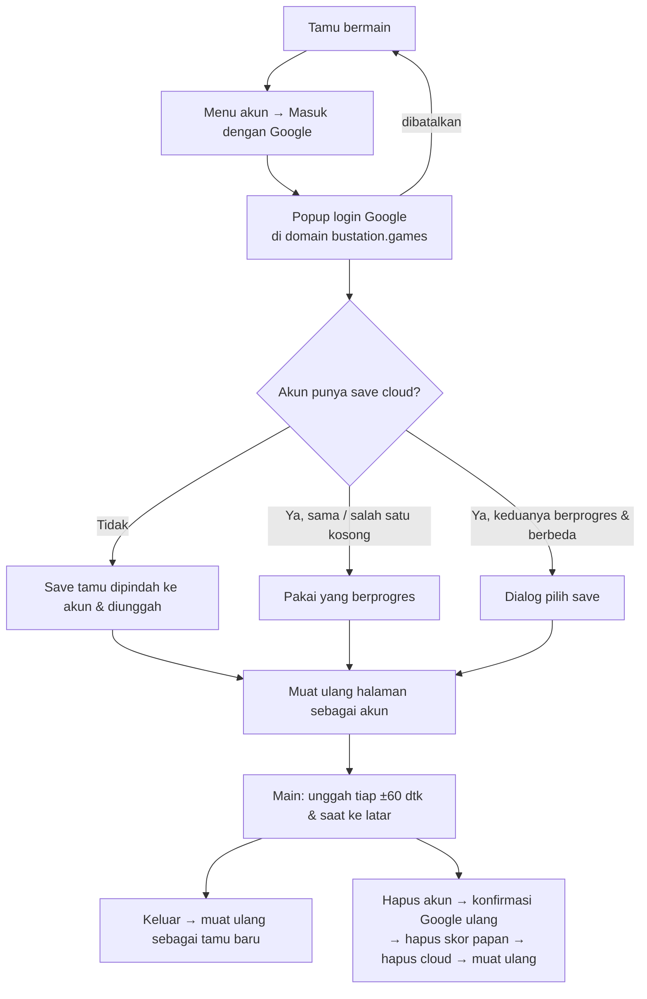
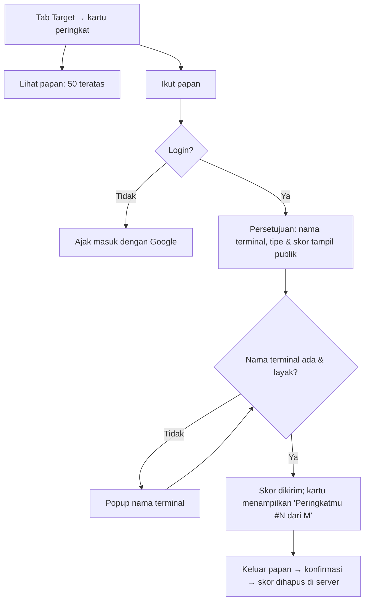
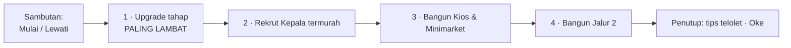

# 07 · UI/UX Flow

Alur layar dari membuka game sampai kembali bermain. Kode UI ada di `src/ui/` (overlay DOM), alur awal di `src/main.ts`, dan sesi di `src/app/sesi.ts`.

## 1. Pemetaan dari alur umum

Template alur umum game sesi adalah *login → lobby → gameplay → result → upgrade*. Bustation adalah idle game satu layar, jadi alurnya berbeda:

| Alur umum | Di Bustation |
|---|---|
| Login | **Opsional.** Pemain langsung bermain sebagai tamu. Login Google lewat menu akun hanya untuk cloud save & papan peringkat (web) |
| Lobby | **Tidak ada lobby.** Game langsung membuka layar utama: adegan terminal + HUD + panel |
| Gameplay | Layar utama yang sama. Terminal selalu berjalan; pemain berbelanja lewat panel |
| Result | **Popup "Selama kamu pergi…"** (hasil offline) dan notifikasi (sewa kios harian, rekor, target selesai). Tidak ada layar hasil per ronde |
| Upgrade | Panel bawah: tab Tahap, Fasilitas, Jurusan, Armada, Modern, Target. Naik kelas lewat popup konfirmasi |

## 2. Alur utama



Catatan:

- UI & simulasi sudah berjalan sebelum grafis 3D siap. Bila WebGL2 tidak tersedia, muncul pesan dan game tetap bisa dimainkan lewat panel.
- Popup pembaruan menunggu popup lain (mis. offline) ditutup dulu.
- Save korup tidak membuat crash: game baru dimulai dan salinan save korup disimpan.

## 3. Layar utama

### 3.1 Portrait (lebar logis 720)

```
┌──────────────────────────────────────────┐
│ Rp 2.607                       ☀ 10:10   │  HUD: uang, jam
│ Hari ini Rp 1.908 · 97 tiket   Selasa ·  │  hasil hari ini, hari & keramaian
│ Arus 9,1 pnp/dtk [Tipe C] [😐 52%] Ramai │  arus, kelas, kepuasan (ketuk)
│                              [1×][2×][3×] │  kecepatan waktu
│ (petunjuk / pil event)                    │
├──────────────────────────────────────────┤
│                                     [🔊] │  kolom kontrol: suara, boost ⚡,
│      ADEGAN 3D TERMINAL             [⚡] │  akun, kompas, putar kiri/kanan,
│   label tahap · "⚠ PALING LAMBAT"   [👤] │  foto, sinema, pembaruan
│   "+Rp" · label bus · Bus Emas      [🧭] │
│   (gelembung tutorial di bawah)     [📷] │
│                             [⌄ Ringkas]  │
├──────────────────────────────────────────┤
│ Tahap | Fasilitas | Jurusan | Armada |   │  tab panel (lencana merah = klaim)
│ Modern | Target                          │
│ [ikon] Peron Lv 1  1 pnp/dtk  [Upgrade]  │  kartu tahap: level, kapasitas,
│        Lv 25: kapasitas ×2    [Kepala ]  │  milestone, tombol upgrade/Kepala
│ [ikon] Loket ⚠ PALING LAMBAT  …          │
│ [ikon] Keberangkatan …                   │
└──────────────────────────────────────────┘
```

### 3.2 Landscape (tinggi logis 720)

Adegan 3D di kiri. Bilah samping kanan (400 px; 152 px saat ringkas) berisi HUD lalu panel.

### 3.3 Mode ringkas

Tombol "Ringkas" melipat panel menjadi rel tiga ikon tahap (cincin warna tahap, level, "!" paling lambat, panah hijau bila upgrade/Kepala terjangkau). HUD ikut diringkas: uang, "Hari ini Rp X", jam, kecepatan. Mengetuk ikon tahap membuka panel penuh. Pilihan disimpan per perangkat.

## 4. Isi panel (upgrade)

| Tab | Isi | Aksi |
|---|---|---|
| **Tahap** | 3 kartu tahap: level, kapasitas, lencana paling lambat / ada Kepala, bilah milestone | Upgrade, Rekrut Kepala |
| **Fasilitas** | Jalur bus (n/5), Kios & Minimarket, Parkir Kendaraan, Toilet & Musholla, Parkir Bus Jurusan, dengan efeknya | Bangun jalur, Bangun/Upgrade fasilitas |
| **Jurusan** | Ringkasan tiket (normal & rata-rata dibayar), grid 16 kota (terbuka/terkunci, ⛴ antarpulau), tombol buka berikutnya, bagian **Harga tiket per jurusan** (batas wajar/peringatan, baris per jurusan: peminat, kursi terisi, saran) | Buka jurusan, −/+ harga, ketuk saran |
| **Armada** | Kelas bus (beli berurutan; yang beroperasi punya −/+ tambahan harga & saran), 20 mitra PO (status & syarat) | Beli kelas bus, −/+ tambahan, kontrak PO |
| **Modern** | 6 modernisasi (2 per tahap) | Pasang |
| **Target** | Kartu kelas terminal (naik kelas, ✎ nama), event musiman, target harian, tantangan mingguan, rekor, papan peringkat, 18 penghargaan | Naik kelas, klaim, klaim 2×, ganti nama, lihat papan |

Tombol yang belum terjangkau tampil nonaktif dengan biaya. Item terkunci menyebut syaratnya (tipe terminal, kelas bus sebelumnya, kepuasan minimal).

## 5. Inventaris popup & overlay

| Popup / overlay | Muncul saat | Keluar |
|---|---|---|
| Selama kamu pergi… | Kembali setelah ≥ 30 dtk | Ambil, Ambil 2× (iklan), area gelap, Esc |
| Versi baru tersedia | Service worker sudah mengunduh rilis baru | Perbarui sekarang (simpan → muat ulang), Nanti (tombol hijau pembaruan tetap ada); versi wajib tanpa Nanti |
| Pilih save | Login / sinkron menemukan dua save berbeda yang sama-sama berprogres | Pilih perangkat ini atau cloud (yang lain jadi cadangan) |
| Menu akun | Tombol 👤 | Masuk dengan Google, Keluar, Hapus akun (konfirmasi ulang), tautan Kebijakan Privasi |
| Kepuasan | Ketuk pil kepuasan HUD | Tutup, area gelap, Esc |
| Naik kelas | Tombol naik kelas di tab Target | Konfirmasi / batal |
| Nama terminal | ✎ di kartu kelas, atau saat ikut papan tanpa nama | Simpan / batal |
| Papan peringkat | "Lihat papan" di tab Target | Tab Minggu ini / Minggu lalu; ikut/keluar papan |
| Hadiah iklan (boost, Bus Emas) | Tombol ⚡ / ketuk Bus Emas | Tonton iklan → hadiah; Nanti |
| Foto terminal | Tombol 📷 | Bagikan, Simpan gambar, Tutup |
| Mode sinema | Tombol klapper → pilih waktu & cuaca | Ketuk layar / Esc |
| Gelembung tutorial | Game baru | Mulai, Lewati, Oke (selesai) |
| Notifikasi singkat | Jalur/jurusan dibuka, PO bergabung, penghargaan, target selesai, sewa kios, rekor, event | Hilang sendiri |

## 6. Alur akun & cloud save (web)



## 7. Alur papan peringkat



Galat yang perlu tindakan pemain tampil di kartu & popup: sesi login berakhir, nama ditolak, jam perangkat salah, akun diblokir.

## 8. Alur tutorial



- Langkah selesai otomatis dalam urutan apa pun. Gelembung selalu menampilkan langkah pertama yang belum selesai.
- Tombol tujuan berkedip. Bila tersembunyi (tab lain, panel ringkas), yang disorot adalah tab atau tombol buka panelnya.
- Kemajuan uang ditampilkan ("Uang Rp 6 / Rp 50" atau "Uang cukup! Ketuk tombol yang berkedip").

## 9. Alur latar & kembali

| Peristiwa | Yang terjadi |
|---|---|
| Tab disembunyikan / app dijeda | Simulasi berhenti, autosave, unggah cloud (bila login), kirim skor peringkat, kirim `ringkasan_sesi` ke GA4, suara berhenti |
| Kembali | Hitung penghasilan offline → popup bila ≥ 30 dtk; cek event & tantangan mingguan; cek versi baru |
| Selama bermain | Autosave tiap 10 dtk; unggah cloud tiap ±60 dtk; cek versi tiap 30 menit; skor tiap ≤ 3 menit |

## 10. Prinsip UX

1. **Tidak menghalangi.** Tutorial, notifikasi, dan saran tidak pernah mengunci aksi pemain.
2. **Selalu ada langkah berikutnya yang jelas.** Tanda paling lambat, panah hijau "terjangkau", lencana klaim, dan tombol saran harga.
3. **Satu sumber angka.** Semua angka UI berasal dari view model (`src/ui/model.ts`) yang diturunkan dari sim, jadi UI tidak menghitung ekonomi sendiri.
4. **Format Indonesia.** Angka memakai pemisah ribuan titik, satuan rb/jt/M/T, dan seluruh teks berbahasa Indonesia (`src/ui/teks.ts`).
5. **Ramah perangkat.** Layout portrait & landscape mengisi layar penuh, area ketuk ≥ 38–44 px, dan animasi dihormati "kurangi gerak".
