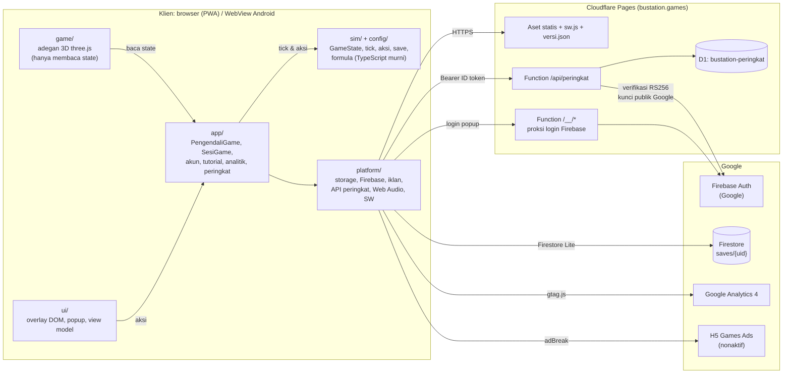

# 08 · Technical Design Document (TDD)

Arsitektur frontend, backend, data, dan deployment **Bustation: Idle Bus**. Rincian operasional ada di `README.md` di akar repositori.

## 1. Arsitektur sistem



Prinsip utama:

1. **Simulasi murni & deterministik** di `src/sim/`: tanpa DOM, three.js, atau jam sistem. Waktu selalu jadi parameter, sehingga seluruh ekonomi bisa dites di Node.
2. **Adegan 3D hanya membaca state.** Keramaian 3D adalah model dekoratif yang lajunya diturunkan dari sim; tidak pernah mengirim aksi.
3. **Klien sebagai otoritas ekonomi.** Tidak ada server game; server hanya untuk papan peringkat (dengan validasi kewajaran) dan cloud save (penyimpanan).
4. **Offline-first.** Save lokal adalah sumber utama, sedangkan cloud adalah salinan.

## 2. Stack & versi

| Bagian | Teknologi |
|---|---|
| Bahasa | TypeScript ~5.9 (strict), ES modules |
| Build | Vite ^8.3, vite-plugin-pwa ^1.3 |
| 3D | three.js ^0.186, postprocessing ^6.39, n8ao ^2.0 (ambient occlusion) |
| Angka besar | break_infinity.js ^2.2 (Decimal) |
| Akun & cloud save | Firebase ^12.19 (Auth, Firestore Lite), dimuat lazy |
| Android | Capacitor ~7.6 (`@capacitor/app`, `@capacitor/preferences`) |
| Server | Cloudflare Pages Functions (TypeScript), Cloudflare D1 (SQLite) |
| Analitik | Google Analytics 4 lewat gtag.js |
| Iklan | Google H5 Games Ads (Ad Placement API) |
| Tes | Vitest ~4.1 |
| Runtime dev | Node ^20.19 atau ≥ 22.12 |

## 3. Struktur kode & batas lapisan

```
src/
  config/     angka tuning (economy.config.ts), waktu & ritme, cuaca, tema, firebase, analitik, iklan, rilis
  sim/        TypeScript murni: formula, GameState + tick(), aksi, save, jam, cuaca, event, tantangan
  app/        PengendaliGame (state + fixed timestep), SesiGame (muat, offline, autosave, pause/resume),
              akun (cloud save), tutorial, analitik, peringkat, iklan, pembaruan, telolet
  game/       adegan 3D three.js; logika denah, keramaian, langit, suara, lalu lintas tetap modul murni
  ui/         overlay DOM: HUD, panel & tab, popup, bingkai layar, format angka Indonesia, view model
  platform/   storage (localStorage / Capacitor Preferences), siklus hidup, Web Audio, Firebase,
              iklan H5, API peringkat, service worker
server/       handler API peringkat, verifikasi token Firebase, kueri D1
functions/    Cloudflare Pages Functions: /__/* (proksi login), /api/peringkat
migrations/   skema D1
tests/        48 berkas tes Vitest
tools/        pemotong aset atlas, pembuat ikon
```

Batas lapisan dijaga otomatis:

- `tsconfig.sim.json` mengecek `sim/`, `config/`, dan `app/` tanpa lib DOM.
- `tests/arsitektur.test.ts` menolak import three.js/Capacitor dari lapisan murni dan modul logika game, serta menolak adegan yang memanggil fungsi pengubah state (`kirim`, `terapkanAksi`, `tick`, dll.).

## 4. Simulasi

| Aspek | Desain |
|---|---|
| State | `GameState` immutable; setiap transisi mengembalikan objek baru (atau objek yang sama bila aksi tidak berlaku) |
| Waktu | Fixed timestep 10 Hz (`SIMULASI.tickPerDetik`), kejar maksimal 1 dtk per frame; kecepatan 1×/2×/3× mengalikan dt |
| Aksi | Data (`Aksi` union di `src/sim/aksi.ts`) diterapkan `terapkanAksi`; memudahkan analitik & tes |
| Angka | Uang & poin memakai `Decimal`; kapasitas & arus memakai `number` |
| Ekonomi | Arus = kapasitas × kursi terisi (permintaan kepuasan × ritme × peminat harga per segmen jurusan × kelas); uang masuk per transaksi (tiket per penumpang utuh, parkir bus per 20 penumpang, sewa kios harian) |
| Turunan | Kepuasan, bottleneck, saran harga dihitung dari state (tidak disimpan); saran harga di-cache per masukan di view model |
| Jam nyata | Event musiman & tantangan mingguan dicocokkan dengan jam dinding WIB saat mulai, saat kembali, dan tiap 30 dtk (`perbaruiJamNyata`) |
| Offline | `terapkanOffline` saat memuat/kembali: kapasitas × harga × min(pergi, 4 jam) × 50%, hanya bila ketiga tahap punya Kepala |

`PengendaliGame` memegang state, menjalankan timestep, memberi tahu pelanggan (UI, adegan, analitik, pengirim skor) tiap state berubah. `SesiGame` menangani muat/simpan, offline, autosave (10 dtk), dan pause/resume.

## 5. Rendering 3D

- Adegan dimuat dengan **dynamic import** setelah UI & sim berjalan. Bila WebGL2 tidak ada, muncul pesan dan game tetap bisa dimainkan.
- Geometri statis digabung per material (`Kumpulan`). Objek dinamis (orang, bus, kendaraan, busa cuci, cahaya malam) memakai `InstancedMesh` tanpa alokasi per frame.
- Material dipakai ulang dari pustaka. Malam/basah hanya mengubah `emissiveIntensity`/warna, jadi shader tidak dikompilasi ulang. Teks papan memakai atlas bersama 2048².
- Post-processing: N8AO (tingkat tertinggi), bloom, tilt-shift, tone mapping ACES, vignette, SMAA.
- **Kualitas adaptif lima tingkat** (`src/game/adegan.ts`): bila frame lambat, kualitas turun bertahap (rasio piksel → AO → multisampling → bayangan → bloom → tilt-shift). Tingkat terendah tanpa bayangan & post-processing. `?tingkat=0..4` mengunci tingkat untuk pengukuran.
- Bayangan matahari mengikuti area yang terlihat kamera dan digambar ulang tiap 2–3 frame di HP.
- Langit prosedural dirender ke cube map 128 px untuk pantulan, hanya diperbarui bila langit berubah.
- **Anggaran performa**: target ±210 draw call & ±450 rb segitiga di tingkat 1 (pengukuran Sep 2026). Pengukuran dev terakhir menunjukkan ±300 draw call di tingkat 1, jadi perlu ditinjau (lihat bagian 16).

## 6. UI overlay

- DOM murni (tanpa framework), dibangun sekali; setiap pembaruan hanya menyentuh node yang nilainya berubah.
- `src/ui/model.ts` menurunkan semua angka tampilan dari state lewat fungsi sim.
- `src/ui/bingkai.ts` men-scale tata letak logis (portrait lebar 720 / landscape tinggi 720, skala maks. 1,1×) agar mengisi layar penuh.
- Semua teks di `src/ui/teks.ts` (bahasa Indonesia); format angka Indonesia di `src/ui/format.ts`.

## 7. Audio

Seluruh bunyi disintesis Web Audio (derau + osilator), tanpa file audio. Logika murni (kekerasan lapisan, kejadian, teks pengumuman) ada di `src/game/suara.ts`; mesin di `src/platform/suara.ts`. Pengumuman memakai `speechSynthesis` bila ada suara bahasa Indonesia. Suara mulai setelah sentuhan pertama (aturan autoplay) dan berhenti saat app dijeda.

## 8. Persistensi lokal

| Aspek | Desain |
|---|---|
| Format | JSON `SaveV1` dengan `schemaVersion`; Decimal sebagai string `"<mantissa>e<exponent>"` |
| Kompatibilitas | Blok baru yang tidak ada di save lama diisi default; blok yang ada tapi salah tipe → save ditolak; field tak dikenal diabaikan; perubahan non-additive lewat `MIGRASI` |
| Penyimpanan | Web: `localStorage`; APK: Capacitor Preferences. Kunci berawalan `terminal-bus-tycoon/` (nama lama dipertahankan agar progres tidak hilang) |
| Kapan | Tiap 10 dtk waktu main, saat pause/latar, setelah offline diterapkan, sebelum aksi penting (login, pembaruan) |
| Korup | Error dicatat, salinan ke `…/save-korup`, game baru dimulai |

Daftar kunci & struktur lengkap ada di [09 · Data Model / ERD](09-data-model-erd.md).

## 9. Akun & cloud save

- **Auth**: Firebase Auth, login Google lewat popup. `authDomain` = `bustation.games` di produksi; `/__/*` diproksikan Cloudflare Function ke `bustation-a4de9.firebaseapp.com`, sehingga login tetap jalan di Safari/PWA iPhone yang memblokir cookie pihak ketiga.
- **Firestore Lite**: satu dokumen per pemain `saves/{uid}` = `{ isi, revisi, schemaVersion, diperbarui }`.
- **Tulis bersyarat**: `firestore.rules` mewajibkan `revisi` naik tepat 1 dari yang tersimpan. Perangkat yang ketinggalan revisi ditolak tanpa membaca dulu, lalu game menanyakan pemain.
- **Aturan konflik** (`src/app/akun.ts`, dites):
  - save yang belum berubah sejak unggahan terakhir boleh diganti versi cloud;
  - dua save yang sama-sama berprogres & berbeda → pemain selalu ditanya;
  - save yang tidak dipilih disimpan sebagai cadangan.
- **Pemuatan**: Firebase hanya dimuat saat pemain membuka menu akun atau sudah login (tamu tidak mengunduhnya). Unduh menyerah setelah 6 dtk, unggah 12 dtk. Unggahan paling sering tiap 60 dtk dan segera saat ke latar.
- **APK**: tombol akun belum tampil (Google memblokir login popup di WebView; perlu plugin native).

## 10. Backend papan peringkat

- **Runtime**: Cloudflare Pages Functions (`functions/api/peringkat/index.ts`, `saya.ts`). Handler di `server/peringkat.ts`; validasi kiriman dipakai bersama game (`src/app/peringkat.ts`).
- **Database**: Cloudflare D1 `bustation-peringkat` (APAC); skema di `migrations/0001_papan_peringkat.sql`.
- **Autentikasi**: header `Authorization: Bearer <ID token Firebase>`. `server/token-firebase.ts` memverifikasi:
  - tanda tangan RS256 dengan kunci publik Google yang di-cache;
  - `aud`/`iss` proyek `bustation-a4de9`;
  - kedaluwarsa;
  - penyedia Google.

  Tanpa SDK Admin dan tanpa kunci rahasia di repo.
- **Validasi**:
  - minggu harus minggu ini menurut jam server (minggu lalu masih diterima 10 menit setelah Senin 00.00 WIB);
  - nama dirapikan & disaring kata kasar;
  - 1 kiriman per 20 dtk per akun;
  - skor tidak pernah turun dan tidak boleh naik melebihi 100.000 pnp/dtk × 3× kecepatan sejak kiriman sebelumnya;
  - akun di tabel `larangan` ditolak.
- **Cache**: GET papan di-cache di edge (minggu ini 60 dtk, minggu lalu 10 menit).
- **Retensi**: hanya minggu ini & minggu lalu; yang lebih tua dibuang saat kiriman berikutnya.
- **Moderasi**: lewat `wrangler d1 execute` (lihat README).

Kontrak endpoint ada di [10 · API Specification](10-api-specification.md).

## 11. Analitik & laporan error

- gtag.js ke GA4 `G-L03D1C21GC` (web saja; tanpa sinyal Google & personalisasi iklan). Peristiwa dipetakan dari aksi di `src/app/analitik.ts` (murni, dites); peristiwa sering (telolet, atur harga) dicatat sekali per sesi per data.
- `exception` untuk error JS/promise & kegagalan 3D (maks. 10 per sesi), `ringkasan_sesi` saat ke latar.
- Dev: peristiwa hanya ke konsol; `?analitik=debug` mengirim ke DebugView.

## 12. Iklan berhadiah

- Kontrak penyedia di `src/app/iklan.ts`; implementasi H5 Games Ads di `src/app/iklan-h5.ts` (dites) + `src/platform/iklan.ts`.
- Alur Ad Placement API:
  1. minta jeda `reward`;
  2. tombol hadiah muncul setelah `beforeReward(showAdFn)`;
  3. ketukan pemain memanggil `showAdFn`;
  4. hadiah hanya pada `adViewed` (`adDismissed` = tanpa hadiah);
  5. suara dibisukan selama iklan;
  6. tanpa iklan: tombol tersembunyi dan permintaan diulang dengan jeda 15 dtk → 5 menit.
- Nonaktif sampai `ID_PENERBIT_ADSENSE` diisi. Build memasang meta `google-adsense-account` & `/ads.txt` otomatis. Mode uji: `?iklan=uji` (iklan uji Google), `?iklan=contoh` (hitung mundur lokal).

## 13. PWA & pembaruan

- `vite-plugin-pwa` (generateSW): precache aset game; `versi.json` & `.jpg` tidak di-precache; `/privasi` dikecualikan dari navigateFallback.
- Build menulis `versi.json` = `{ versi, versiMinimal, catatan, dibuat }` dari `package.json` & `src/config/rilis.config.ts`.
- Service worker mengunduh rilis baru di latar. Game memeriksa saat dibuka, tiap 30 menit, dan saat kembali terlihat, lalu menampilkan popup "Versi baru tersedia". Versi di bawah `versiMinimal` mendapat popup wajib.

## 14. Android

- Capacitor 7 membungkus `dist/` (`appId` sementara `id.terminalbus.tycoon`, harus diganti sebelum rilis Play Store; `appName` "Bustation").
- Build: `npm run cap:sync`, lalu Gradle dengan JDK 21 (JBR Android Studio), Android SDK 35. Pembaruan APK lewat Play Store (service worker tidak aktif di APK).

## 15. Deployment

| Komponen | Cara deploy | Catatan |
|---|---|---|
| Situs & Functions | `npm run deploy:web` = typecheck + `vite build` + `wrangler pages deploy dist --project-name bustation` | Wajib lewat wrangler dari repo agar `functions/` & `wrangler.toml` ikut |
| D1 | `npx wrangler d1 migrations apply bustation-peringkat --remote` | Sebelum deploy kode yang membutuhkan skema baru |
| Firestore rules | Tempel `firestore.rules` di Firebase console | Manual |
| Rilis versi | Naikkan `version`, isi `catatan` (& `versiMinimal` bila perlu), deploy | Lihat README "Merilis versi baru" |
| Android | `npm run cap:sync` + Gradle | Belum dirilis |

Lingkungan lokal: `npm run dev` (Vite). Untuk API peringkat lokal: `wrangler pages dev dist` (port 8788) dengan D1 lokal; Vite meneruskan `/api` ke sana.

## 16. Tes & kualitas

- `npm run typecheck` (tsconfig app + sim), `npm run test` (Vitest, **645 tes dalam 48 berkas** per 6 Oktober 2026), `npm run build`.
- Cakupan tes:
  - formula ekonomi & strategi greedy vs spreadsheet;
  - state & aksi, save/migrasi, akun & konflik cloud;
  - peringkat (klien & server, termasuk verifikasi token);
  - harga tiket, tutorial, analitik, iklan H5;
  - geometri denah (bus tidak bersenggolan), keramaian, langit, suara;
  - arsitektur.
- Verifikasi visual: `.claude/skills/terminal-threejs/shot.mjs` (Chrome headless) mengambil screenshot dengan save yang disuntik.
- **Item terbuka**:
  - anggaran draw call (±300 terukur vs target ±210);
  - registrasi custom dimension GA4;
  - login & iklan native di APK.

## 17. Keamanan & privasi

- Tidak ada rahasia di repo. Konfigurasi Firebase web bersifat publik; server memverifikasi token dengan kunci publik Google.
- `firestore.rules`: hanya pemilik (uid) yang boleh membaca/menulis/menghapus dokumennya; bentuk dokumen & ukuran `isi` ≤ 100.000 karakter divalidasi.
- uid tidak pernah dikirim ke pemain lain. Papan memakai `id_publik` (hash cyrb53 uid) hanya untuk menandai baris sendiri.
- Nama terminal tidak pernah dikirim ke analitik (hanya ada/tidaknya).
- Kebijakan privasi (`public/privasi.html`, ID/EN) mengacu UU No. 27/2022 (PDP), mencakup cloud save, analitik, papan peringkat, dan iklan berhadiah. Hapus akun menghapus skor papan dan cloud save.

## 18. Kuota & skalabilitas

| Layanan | Batas gratis | Pemakaian per pemain |
|---|---|---|
| D1 baca | 5 juta baris/hari | Papan ±50 baris (cache 60 dtk); peringkat sendiri ≤ 1.000 baris, paling sering tiap 5 menit |
| D1 tulis | 100 rb baris/hari | ±1 kiriman per 3 menit per pemain yang ikut |
| Workers | 100 rb permintaan/hari | Semua rute `/api` |
| Firestore | Kuota gratis Firebase | Unggah ≤ 1 per 60 dtk per pemain login + saat ke latar |

Bila pemain bertambah banyak: Cloudflare Workers Paid ($5/bulan).
