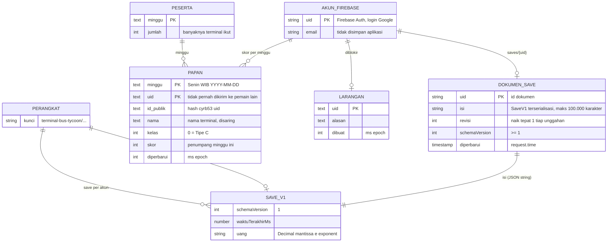
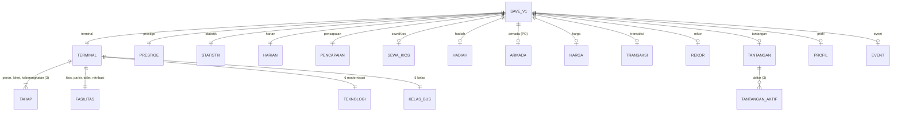

# 09 · Data Model / ERD

Struktur data dan relasinya. Data tersimpan di empat tempat:

| Tempat | Isi | Kode |
|---|---|---|
| Perangkat (localStorage / Capacitor Preferences) | Save game (JSON `SaveV1`), pilihan tampilan, status tutorial, akun aktif | `src/sim/save.ts`, `src/app/sesi.ts`, `src/app/akun.ts` |
| Firestore `saves/{uid}` | Salinan save untuk pemain login | `src/platform/firebase.ts`, `firestore.rules` |
| Cloudflare D1 `bustation-peringkat` | Papan peringkat mingguan | `migrations/0001_papan_peringkat.sql`, `server/d1.ts` |
| Google Analytics 4 | Peristiwa anonim (bukan database aplikasi) | `src/app/analitik.ts` |

## 1. ERD keseluruhan



## 2. Model save game (`SaveV1`)

Save adalah satu dokumen JSON bersarang, bukan tabel relasional. Diagram berikut memperlihatkan blok-bloknya; kardinalitas menunjukkan berapa entri tiap blok.



### 2.1 Blok & field

`o|` = blok opsional. Save lama tanpa blok itu dimuat dengan nilai awal.

| Blok | Field | Tipe | Keterangan |
|---|---|---|---|
| (akar) | `schemaVersion` | int | Saat ini 1 |
| | `waktuTerakhirMs` | number | Terakhir aktif (dasar offline) |
| | `uang` | Decimal-string | `"<mantissa>e<exponent>"` |
| | `benihCuaca` | int | Benih jadwal hujan & Bus Emas |
| `terminal` | `id` | string | `tipe-c` (disiapkan untuk terminal tambahan) |
| | `tahap.<peron\|loket\|keberangkatan>` | `{ level: int ≥ 1, kepala: { direkrut: bool } }` | Wajib |
| | `fasilitas.<kios\|parkir\|toilet\|retribusi>` | int ≥ 0 | 0 = belum dibangun |
| | `jurusanBuka` | int | 2 … 16 |
| | `teknologi.<rambuHalte\|pengaturBus\|mesinTiket\|eTiket\|jadwalDigital\|gateOtomatis>` | bool | |
| | `kelasBus.<ekonomi\|patas\|eksekutif\|sleeper\|tingkat>` | bool | Ekonomi selalu true |
| | `jalur` | int | 1 … 5 |
| `prestige` | `poin` | Decimal-string | Poin prestige |
| | `jumlahReset` | int | = kelas terminal (0 = Tipe C) |
| `statistik` | `totalPendapatanRun`, `totalPendapatanSepanjangMasa` | Decimal-string | |
| | `waktuMainDetik` | number | Sumber jam terminal |
| | `totalPenumpang` | number | Sepanjang masa |
| `harian` | `hariKe`, `jenis` (`upgrade`/`penumpang`), `target`, `progres`, `diklaim`, `jumlahSelesai` | | Target harian |
| `pencapaian` | `tercapai[]`, `diklaim[]` | string[] | Id pencapaian; id tak dikenal diabaikan |
| `sewaKios` | `terkumpul`, `terakhir` (Decimal-string), `hariTerakhir` | | Sewa harian |
| `hadiah` | `boostDetik`, `busEmas { tungguDetik, aktifDetik, jumlah }` | number | Boost & jadwal Bus Emas |
| `armada` | `po[]` | string[] | Mitra PO, urut bergabung |
| `harga` | `jurusan[]` | int[] (persen) | Harga tiap jurusan, 50–200 (100 = normal) |
| | `tambahanKelas.<kelas>` | int (persen) | 0–100 |
| `transaksi` | `sisaPenumpang` | number < 1 | Pecahan penumpang belum membeli tiket |
| | `sisaBus` | number < 20 | Penumpang sejak bus terakhir membayar parkir |
| `rekor` | `hariKe`, `penumpangHariIni`, `pendapatanHariIni`, `penumpangHarian`, `pendapatanHarian`, `arusTertinggi` | number | |
| `tantangan` | `minggu` (string \| null), `selesaiMs`, `daftar[] { jenis, target, progres, diklaim }`, `penumpang` | | `penumpang` = skor papan peringkat |
| `profil` | `namaTerminal` (≤ 18 huruf), `ikutPeringkat` | string, bool | |
| `event` | `aktif { id, edisi, selesaiMs } \| null`, `edisi`, `progres`, `diklaim`, `target[]` | | Event musiman per edisi (mis. `mudikLebaran-2027`) |

**Tidak disimpan** (turunan atau sementara): kepuasan, bottleneck, saran harga, kursi terisi, bonus 2× offline (`hadiah.bonusOffline`, hanya ditawarkan di popup).

### 2.2 Contoh save (diringkas)

```json
{
  "schemaVersion": 1,
  "waktuTerakhirMs": 1791158400000,
  "uang": "2.607e3",
  "terminal": {
    "id": "tipe-c",
    "tahap": {
      "peron": { "level": 20, "kepala": { "direkrut": true } },
      "loket": { "level": 21, "kepala": { "direkrut": true } },
      "keberangkatan": { "level": 20, "kepala": { "direkrut": true } }
    },
    "fasilitas": { "kios": 3, "parkir": 1, "toilet": 2, "retribusi": 0 },
    "jurusanBuka": 8,
    "teknologi": { "rambuHalte": false, "pengaturBus": false, "mesinTiket": true, "eTiket": false, "jadwalDigital": false, "gateOtomatis": false },
    "kelasBus": { "ekonomi": true, "patas": true, "eksekutif": true, "sleeper": false, "tingkat": false },
    "jalur": 3
  },
  "prestige": { "poin": "0e0", "jumlahReset": 0 },
  "harga": { "jurusan": [90, 100, 100, 100, 100, 100, 100, 110, 100, 100, 100, 100, 100, 100, 100, 100], "tambahanKelas": { "ekonomi": 0, "patas": 0, "eksekutif": 10, "sleeper": 0, "tingkat": 0 } },
  "transaksi": { "sisaPenumpang": 0.42, "sisaBus": 13.42 },
  "profil": { "namaTerminal": "Sukamaju", "ikutPeringkat": true }
}
```

### 2.3 Aturan kompatibilitas

- Field wajib (`uang`, `terminal.tahap`) hilang atau salah tipe → save ditolak (dianggap korup).
- Blok opsional yang hilang → nilai awal. Blok yang ada tapi salah tipe → ditolak.
- Nilai di luar batas yang bisa dirapikan (harga, jumlah jurusan, jalur) → dirapikan, bukan ditolak.
- Field tak dikenal diabaikan. Perubahan non-additive → naikkan `VERSI_SKEMA` dan tambah fungsi di `MIGRASI`.

## 3. Kunci penyimpanan di perangkat

| Kunci | Isi |
|---|---|
| `terminal-bus-tycoon/save` | Save tamu (JSON `SaveV1`) |
| `terminal-bus-tycoon/save-korup` | Salinan save tamu yang gagal dimuat |
| `terminal-bus-tycoon/akun-aktif` | uid akun yang sedang login (tidak ada = tamu) |
| `terminal-bus-tycoon/akun/{uid}/save` | Save akun di perangkat ini |
| `terminal-bus-tycoon/akun/{uid}/save-korup` | Salinan save akun yang gagal dimuat |
| `terminal-bus-tycoon/save-cadangan` | Save yang tidak dipilih saat konflik login (ditimpa tiap kali) |
| `terminal-bus-tycoon/tutorial` | `aktif` / `selesai` / `dilewati` |
| `terminal-bus-tycoon/panel` | `ringkas` atau kosong |
| `terminal-bus-tycoon/kecepatan` | 1 / 2 / 3 |
| `terminal-bus-tycoon/suara` | Pilihan suara nyala/mati |

## 4. Firestore: `saves/{uid}`

| Field | Tipe | Aturan (`firestore.rules`) |
|---|---|---|
| `isi` | string | Wajib, 1 … 100.000 karakter; isi = `serialisasi(state)` |
| `revisi` | int | Dokumen baru: 1. Update: harus = revisi tersimpan + 1 |
| `schemaVersion` | int | ≥ 1 |
| `diperbarui` | timestamp | Harus `request.time` (serverTimestamp) |

- Hanya pemilik (`request.auth.uid == uid`) yang boleh `get`, `create`, `update`, `delete`.
- Field lain ditolak (`keys().hasOnly([...])`).

## 5. D1: papan peringkat

```sql
CREATE TABLE papan (
  minggu TEXT NOT NULL,        -- Senin WIB "YYYY-MM-DD"
  uid TEXT NOT NULL,           -- uid Firebase (tidak pernah dikirim ke pemain lain)
  id_publik TEXT NOT NULL,     -- hash uid untuk menandai baris sendiri
  nama TEXT NOT NULL,          -- nama terminal (dirapikan & disaring)
  kelas INTEGER NOT NULL,      -- 0 = Tipe C, 1 = Tipe B, ...
  skor INTEGER NOT NULL,       -- penumpang minggu ini
  diperbarui INTEGER NOT NULL, -- ms epoch kiriman terakhir
  PRIMARY KEY (minggu, uid)
);
CREATE INDEX papan_urut ON papan (minggu, skor DESC, diperbarui);
CREATE INDEX papan_uid ON papan (uid);

CREATE TABLE peserta (minggu TEXT PRIMARY KEY, jumlah INTEGER NOT NULL);
CREATE TABLE larangan (uid TEXT PRIMARY KEY, alasan TEXT NOT NULL DEFAULT '', dibuat INTEGER NOT NULL);
```

| Tabel | Kunci | Relasi | Retensi |
|---|---|---|---|
| `papan` | (`minggu`, `uid`) | `uid` → akun Firebase; `minggu` → `peserta.minggu` | Hanya minggu ini & minggu lalu |
| `peserta` | `minggu` | 1 baris per minggu, dihitung saat baris `papan` baru masuk | Mengikuti `papan` |
| `larangan` | `uid` | Diisi manual oleh moderator | Permanen |

Urutan papan: `skor DESC`, lalu `diperbarui` (yang lebih dulu mencapai skor itu di atas). Skor sama → peringkat tampilan sama (1, 2, 2, 4).

## 6. Data analitik (GA4)

Bukan database aplikasi. Peristiwa anonim dengan parameter kecil (mis. `tahap`, `level`, `jurusan`, `kelas`, `po`, `cara`, `jenis`, `minggu`). Tidak ada nama terminal, email, atau uid. Daftar peristiwa ada di [10 · API Specification](10-api-specification.md#5-google-analytics-4-keluar).
