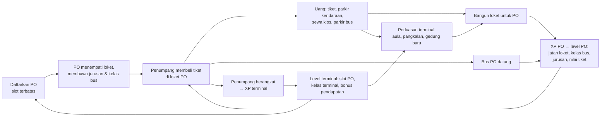
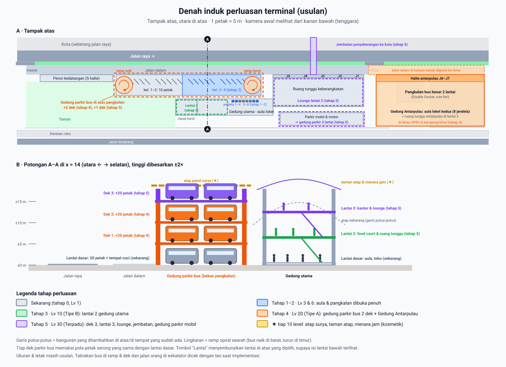

# 12 · Rancangan Ekonomi v2: Mitra PO

> **Status: diimplementasi sebagian di cabang `ekonomi-v2`** (langkah 0–3 di bagian 18 dan sebagian langkah 4: simulasi, save & migrasi v1 → v2, tab PO & Terminal, adegan mengikuti jurusan yang dilayani PO). Belum: jendela loket per PO & tahap perluasan di 3D, tutorial baru, rilis bertahap, dan bangunan bertingkat. Dokumen 01–11 masih menggambarkan v1. Isinya disusun dari diskusi desain 7 Oktober 2026.
>
> Angka bertanda **PLACEHOLDER** adalah titik awal hasil simulasi (bagian 15), bukan angka final. Setelah diimplementasi, angka tuning tetap tinggal di `src/config/economy.config.ts`.

## 1. Ringkasan

Mitra PO menjadi pusat permainan. Terminal tetap membangun Peron, Keberangkatan, fasilitas, dan jalur, tapi **loket kini disewa PO**. Tiap PO punya hal-hal berikut sendiri:

- level;
- loket;
- jurusan;
- kelas bus;
- reputasi;
- harga tiket;
- kontrak.

Ada tiga hal yang tidak pernah di-reset:

- **level PO**;
- **level terminal**;
- **perluasan terminal**: terminal makin luas dan bertingkat secara fisik, dan tidak pernah terlihat menyusut.



## 2. Keputusan yang sudah diambil

| # | Keputusan | Akibatnya di rancangan |
|---|---|---|
| 1 | Loket milik PO **menggantikan** tahap Loket | Kapasitas loket = jumlah loket yang disewa PO (bagian 4) |
| 2 | Ada **level terminal** baru. Kelas terminal (Tipe C → B → A → Terpadu) mengikuti level | Naik kelas lewat level, bukan reset (bagian 7) |
| 3 | Kontrak PO bisa **diputus**. PO **keluar sendiri** saat kontraknya habis | Slot jadi keputusan nyata. Loket PO yang pergi menjadi kosong (bagian 5.4) |
| 4 | **Renovasi** menggantikan prestige | Kapasitas di-reset, PO & level terminal tetap. Tanpa reset, ekonomi mentok setelah ±12 jam main (bagian 9 & 15) |
| 5 | **Perluasan terminal** lima tahap, **jalur bus permanen** | Terminal makin luas seiring level dan tidak pernah menyusut (bagian 8) |
| 6 | **Tempo kelas terminal yang lebih lambat** | Kurva XP terminal 4.500 × (T − 1)^3,2. Pemain optimal: Tipe B ±1,4 jam, Tipe A ±5,9 jam, Terpadu ±17 jam main aktif (bagian 7 & 15) |
| 7 | Perluasan **bertingkat**, termasuk **parkir bus bertingkat**. Denah boleh dirombak bila perlu | Lantai 2–3 gedung utama, gedung parkir bus 3–4 lantai, Gedung Antarpulau 2 lantai (bagian 8) |
| 8 | Proyek perluasan **tetap berjalan saat offline** | Proyek sehari terminal tidak perlu ditunggui; dibatasi 4 jam seperti penghasilan offline (bagian 11) |

## 3. Perubahan dibanding v1

| Sistem | v1 (sekarang) | v2 |
|---|---|---|
| Loket | Satu tahap untuk seluruh terminal | Terminal membangun loket, PO menyewanya. Jatah loket per PO ikut level PO dan perluasan |
| Jurusan | Dibeli berurutan, bonus tiket menumpuk untuk semua penumpang | Dibawa PO: 1–3 per PO, terbuka seiring level PO. Tiap jurusan punya nilai tiket sendiri |
| Kelas bus | Dibeli berurutan untuk seluruh terminal | Per PO, terbuka seiring level PO, dibatasi tingkat PO |
| Mitra PO | +3% harga tiket per PO, permanen | Unit utama: level, loket, reputasi, harga, kontrak, slot |
| Harga tiket | Per jurusan + tambahan per kelas | Per PO × jurusan. Selisih harga antarkelas otomatis |
| Tiket terlalu mahal | Kepuasan seluruh terminal turun | Reputasi PO itu saja yang turun |
| Kelas terminal | Naik lewat prestige (reset) | Dari level terminal (XP = penumpang) |
| Prestige | Naik kelas = reset hampir semua | Renovasi: reset kapasitas. PO, level terminal, perluasan, jalur tetap |
| Jalur bus | Dibeli per run, ikut di-reset | Dibeli sekali, permanen |
| Denah terminal | Tetap, satu lantai. Sebagian ditutup barikade sampai dibuka | Bertambah luas dan bertingkat lewat perluasan: lantai baru, gedung parkir bus, gedung antarpulau |
| Kepala Loket | Menjalankan tahap Loket | Menjadi **Kepala Kemitraan**: mengisi loket kosong dan memperpanjang kontrak otomatis |

Yang **tidak berubah**:

- Peron, Keberangkatan, fasilitas, modernisasi;
- kepuasan, permintaan per jam, penghasilan offline;
- hadiah iklan, target harian, tantangan mingguan, event, papan peringkat.

## 4. Kapasitas & loket

```
throughput        = min(Peron, Loket, Keberangkatan)                      (sama dengan v1)
kapasitas Loket   = kapasitas_v1('loket', N_terisi) × modernisasi loket
N_terisi          = jumlah loket yang disewa semua PO
biaya loket baru  = Rp 22 × 1,085^(N_total − 1)        N_total = N_terisi + loket kosong
jatah loket PO    = 6 + 4 × (level PO − 1) + bonus perluasan (bagian 8)      (PLACEHOLDER)
```

- Rumus kapasitas dan biaya loket sama dengan tahap Loket v1, termasuk milestone ×2 di 25/50/100/200 loket. Kurva yang sudah teruji tetap dipakai.
- **Bangun loket**: loket baru selalu untuk satu PO yang jatahnya masih ada.
  - Tombol di kartu Loket otomatis memilih PO yang paling menguntungkan dan menyebutnya ("→ PO Lumpia Kilat").
  - Kartu PO punya tombol "+ Loket" sendiri untuk memilih manual.
  - Loket baru memberi XP ke PO itu (bagian 5.5).
- **Loket kosong**: loket PO yang keluar tetap milik terminal.
  - Loket kosong tidak melayani penumpang sampai disewa PO lain. Jadi kapasitas turun sementara.
  - Mengisi loket kosong gratis.
- **Loket bawaan**: PO yang baru bergabung langsung menempati 2–4 loket menurut tingkatnya.
  - Loket kosong dipakai lebih dulu.
  - Kalau kurang, PO membangun sendiri. Pemain tidak membayar, tapi N_total bertambah.
- **Jatah penuh**: bila jatah semua PO penuh, loket tidak bisa dibangun. Kartu Loket menyarankan cara membukanya:
  - naikkan level PO;
  - daftarkan PO baru;
  - bangun perluasan;
  - ganti PO yang lemah.

  Di simulasi, kondisi ini sering terjadi di jam pertama. Ini memang disengaja: level PO dan PO baru jadi penting. Pemain tidak menganggur karena uangnya bisa ke fasilitas (bagian 15).

## 5. Mitra PO

### 5.1 Tingkat PO

| Tingkat | Kelas bus maks. | Reputasi awal | Loket bawaan |
|---|---|---|---|
| Lokal | Eksekutif | 45 | 2 |
| Regional | Sleeper | 50 | 3 |
| Nasional | Double Decker | 55 | 4 |
| Premium | Double Decker | 65 | 4 |

PO Premium hanya mau bergabung (dan memperpanjang) bila kepuasan terminal cukup tinggi.

### 5.2 Daftar PO (PLACEHOLDER)

Nama dan kota asal sama dengan v1. Jurusan ke-2 terbuka di PO Lv 6, jurusan ke-3 di Lv 12. Jurusan antarpulau tetap butuh kelas terminalnya.

| PO | Tingkat | Jurusan (Lv 1 · Lv 6 · Lv 12) | Syarat | Biaya daftar |
|---|---|---|---|---|
| Ondel-Ondel | Lokal | Jakarta · Semarang · Surabaya | PO awal | – |
| Peuyeum Kilat | Lokal | Bandung · Yogyakarta · Solo | – | Rp 50 |
| Lumpia Kilat | Lokal | Semarang · Jakarta · Malang | – | Rp 1,5 rb |
| Bakpia Rasa | Regional | Yogyakarta · Bandung · Denpasar | – | Rp 12 rb |
| Wayang Lestari | Regional | Solo · Jakarta · Surabaya | – | Rp 60 rb |
| Arek Ekspres | Regional | Surabaya · Malang · Denpasar | – | Rp 300 rb |
| Telolet Jaya | Premium | Semarang · Jakarta · Denpasar | Kepuasan ≥ 65% | Rp 1 jt |
| Apel Batu | Regional | Malang · Jakarta · Denpasar | Tipe B | Rp 3 jt |
| Kecak Laju | Nasional | Denpasar · Surabaya · Mataram | Tipe B | Rp 12 jt |
| Siger Sakti | Regional | Lampung · Palembang · Jakarta | Tipe B | Rp 40 jt |
| Juara Kelas | Nasional | Jakarta · Bandung · Palembang | Hadiah Tipe B | Gratis |
| Sultan Garasi | Premium | Jakarta · Denpasar · Medan | Tipe B, kepuasan ≥ 80% | Rp 150 jt |
| Rinjani Indah | Nasional | Mataram · Bima · Denpasar | Tipe A | Rp 600 jt |
| Rumah Gadang | Nasional | Padang · Jambi · Jakarta | Tipe A | Rp 2,5 M |
| Juara Umum | Nasional | Padang · Jambi · Medan | Hadiah Tipe A | Gratis |
| Danau Toba | Nasional | Medan · Banda Aceh · Padang | Terpadu | Rp 12 M |
| Kopi Gayo | Nasional | Banda Aceh · Medan · Jakarta | Terpadu | Rp 50 M |
| Mudik Ceria | Regional | Semarang · Yogyakarta · Solo | Hadiah event Mudik | Gratis |
| Merah Putih | Nasional | Jakarta · Surabaya · Denpasar | Hadiah event HUT RI | Gratis |
| Kembang Api | Nasional | Denpasar · Mataram · Bima | Hadiah event Nataru | Gratis |

- PO hadiah tidak otomatis menempati slot. Ia masuk daftar PO yang bisa didaftarkan gratis, dengan kontrak pertama 14 hari terminal.
- Jurusan yang sama sengaja muncul di beberapa PO. Contohnya, Jakarta ada di 11 PO. Pemain harus memilih antara jurusan ramai yang diperebutkan dan jurusan jauh yang lebih mahal (bagian 6.2).

### 5.3 Slot PO (PLACEHOLDER)

| Level terminal | 1 | 3 | 6 | 10 (Tipe B) | 14 | 20 (Tipe A) | 25 | 30 (Terpadu) | 40 | 50 | 60 |
|---|---|---|---|---|---|---|---|---|---|---|---|
| Slot PO | 2 | 3 | 4 | 5 | 6 | 7 | 8 | 9 | 10 | 11 | 12 |

- Slot ikut level terminal, sesuai idemu: makin besar terminal, makin banyak PO.
- Aula loket sekarang hanya punya 8 jendela. Slot 9–12 butuh aula kedua dari perluasan tahap 4 (bagian 8).

### 5.4 Kontrak

| Aturan | Nilai (PLACEHOLDER) |
|---|---|
| Lama kontrak | 7 hari terminal (±2 jam 48 menit main aktif). Hari terminal berhenti saat game ditutup, jadi kontrak tidak habis saat pemain pergi |
| Perpanjang | Kapan saja, +7 hari, sisa maksimal 14 hari |
| Biaya perpanjang | 10 menit pendapatan PO itu (harga normal), minimal Rp 50 |
| Perpanjang otomatis | Oleh Kepala Kemitraan, bila uang cukup |
| PO Premium | Menolak memperpanjang bila kepuasan di bawah syaratnya |
| Habis | PO keluar. Loketnya jadi kosong. PO itu boleh didaftarkan lagi kapan saja (bayar biaya daftar) |
| Putus | Gratis, langsung keluar. Loketnya jadi kosong. Reputasi PO −10. Tidak bisa didaftarkan lagi selama 3 hari terminal |
| Riwayat | Level, XP, reputasi, rekor loket, dan harga PO yang keluar disimpan. Daftar ulang melanjutkan dari situ |
| Pengaman | Terminal selalu punya minimal 1 PO. PO terakhir tidak bisa diputus, dan kontraknya diperpanjang gratis |

- Notifikasi muncul 1 hari terminal sebelum kontrak habis.
- Masa jeda setelah putus kontrak itu perlu. Tanpa itu, simulasi menemukan pemain bisa bolak-balik mengganti PO untuk keuntungan kecil.

### 5.5 Level PO

**XP PO**:

- **Bus datang**: 1 XP per bus PO itu (1 bus = 20 penumpang yang membeli tiketnya). Saat offline dihitung ×50%.
- **Loket baru** untuk PO itu: XP = 10% dari XP yang dibutuhkan level sekarang.
  - Hanya loket yang melampaui rekor jumlah loket PO itu yang memberi XP.
  - Mengisi loket kosong dan membangun ulang setelah Renovasi tidak memberi XP. Tanpa aturan ini, tiap Renovasi menjadi "panen" XP.
  - Dengan jatah +4 per level, loket menyumbang paling banyak ±40% XP tiap level. Sisanya dari bus. Di simulasi: ±50% di jam pertama, ±30% sesudahnya.

**Kurva** (PLACEHOLDER): XP kumulatif untuk mencapai level L = `15 × (L − 1)³` bus.

| Level PO | 2 | 3 | 6 | 10 | 12 | 15 | 20 | 30 |
|---|---|---|---|---|---|---|---|---|
| XP kumulatif (bus) | 15 | 120 | 1.875 | 10.935 | 19.965 | 41.160 | 102.885 | 365.835 |

**Hadiah per level**:

| Level | Hadiah |
|---|---|
| Tiap level | Jatah loket +4 (Lv 1 = 6 loket). Nilai tiket PO ×1,06 |
| 3 | Kelas Patas AC |
| 6 | Kelas Eksekutif, jurusan ke-2 |
| 10 | Kelas Sleeper (butuh terminal Tipe B, PO Regional ke atas) |
| 12 | Jurusan ke-3 |
| 15 | Kelas Double Decker (butuh terminal Tipe A, PO Nasional/Premium) |

Level PO tidak punya batas atas. Setelah Lv 15, tiap level menambah jatah loket dan nilai tiket.

### 5.6 Kelas bus (PLACEHOLDER)

| Kelas | Nilai tiket | Peminat | Elastisitas | Level PO | Kelas terminal |
|---|---|---|---|---|---|
| Ekonomi | ×1,00 | 4 | 2,0 | 1 | Tipe C |
| Patas AC | ×1,25 | 3 | 1,6 | 3 | Tipe C |
| Eksekutif | ×1,60 | 2 | 1,35 | 6 | Tipe C |
| Sleeper | ×2,10 | 1 | 1,2 | 10 | Tipe B |
| Double Decker | ×2,60 | 1 | 1,15 | 15 | Tipe A |

Peminat dan elastisitas sama dengan v1. Nilai tiket menggantikan bonus kelas v1 yang menumpuk untuk semua penumpang.

### 5.7 Reputasi

Reputasi PO bernilai 0–100 dan tampil sebagai bintang 0–5.

```
target reputasi = 50 × kepuasan terminal + 30 × skor harga + 20 × skor armada
skor harga      = jepit((150 − harga rata-rata PO) ÷ 60, 0, 1)    (≤ 90% → 1; 100% → 0,83; 120% → 0,5; ≥ 150% → 0)
skor armada     = kelas bus aktif PO ÷ 5
reputasi        bergerak ke target, ±5% selisihnya per menit main (konstanta waktu ±20 menit)
```

**Efek**:

- **Minat penumpang**: × (0,7 + 0,6 × reputasi/100), yaitu 0,7–1,3.
- **Persaingan**: di jurusan yang sama, PO yang lebih bereputasi dan lebih murah mendapat bagian lebih besar (bagian 6.2).

Penalti "tiket terlalu mahal" pindah dari kepuasan terminal ke reputasi PO itu. Menaikkan harga memberi uang lebih sekarang, tapi pelan-pelan mengurangi penumpang PO itu.

## 6. Penumpang & pendapatan

### 6.1 Segmen & kursi

Penumpang dibagi ke **segmen** (PO i, jurusan j, kelas k). Mesinnya sama dengan segmen jurusan × kelas di v1, ditambah PO.

```
jatah kursi  w = (loket_i ÷ N_terisi) × (peminat_j ÷ Σ peminat jurusan PO i) × (peminat_k ÷ Σ peminat kelas PO i)
minat        q = permintaan × f(reputasi_i) × (harga_ij ÷ 100)^(−e) × persaingan_ij × kejenuhan_j
                 e = (elastisitas_j + elastisitas_k) ÷ 2,  f(r) = 0,7 + 0,6 × r/100
terisi       = min(1, q)                           kursi kosong tidak diisi segmen lain (seperti v1)
arus         = throughput × Σ w × terisi
```

`permintaan` tetap rumus v1: daya tarik kepuasan × ritme jam.

### 6.2 Persaingan & kejenuhan jurusan

Persaingan antar-PO di jurusan yang sama dihitung dari daya tarik masing-masing:

```
daya tarik a_ij  = f(reputasi_i) × (harga_ij ÷ 100)^(−elastisitas_j)
persaingan_ij    = a_ij ÷ ā_j        ā_j = rata-rata a semua PO di jurusan j, berbobot kursi
kejenuhan_j      = 1 ÷ (1 + 0,3 ÷ peminat_j × (jumlah PO di jurusan j − 1))
```

- Satu PO sendirian di jurusannya mendapat persaingan = 1 dan kejenuhan = 1. Hasilnya sama dengan v1.
- PO yang lebih murah atau lebih bereputasi dari rata-rata pesaingnya mendapat penumpang lebih banyak, dan pesaingnya kehilangan.
- Jurusan ramai menampung banyak PO, jurusan sepi cepat jenuh:

| Jurusan (peminat) | 2 PO | 3 PO | 4 PO |
|---|---|---|---|
| Jakarta (3) | 0,91 | 0,83 | 0,77 |
| Semarang (1,5) | 0,83 | 0,71 | 0,63 |
| Banda Aceh (0,4) | 0,57 | 0,40 | 0,31 |

### 6.3 Harga tiket

- Pemain mengatur harga per PO × jurusan: 50–200% harga normal, kelipatan 10%. Bawaan 100%.
- Harga normal segmen = `Rp 5 × nilai jurusan × nilai kelas × 1,06^(level PO − 1)`. Pemain melihatnya dalam Rupiah per kelas.
- Tombol **Saran** per PO memakai algoritme v1 per jurusan, dengan harga pesaing dianggap tetap.
- **Anti-curang** tetap seperti v1: hadiah "N menit pendapatan", target, rekor, dan offline memakai harga normal.

**Nilai jurusan** (PLACEHOLDER) menggantikan bonus tiket v1 yang menumpuk. Peminat, elastisitas, dan kelas terminal sama dengan v1.

| Jurusan | Nilai | Jurusan | Nilai | Jurusan | Nilai | Jurusan | Nilai |
|---|---|---|---|---|---|---|---|
| Jakarta | 1,0 | Solo | 1,9 | Lampung (B) | 4,2 | Padang (A) | 8,4 |
| Bandung | 1,0 | Surabaya | 2,4 | Palembang (B) | 5,2 | Bima (T) | 10 |
| Semarang | 1,4 | Malang | 2,8 | Mataram (A) | 6,4 | Medan (T) | 12 |
| Yogyakarta | 1,7 | Denpasar | 3,6 | Jambi (A) | 7,2 | Banda Aceh (T) | 15 |

B = butuh Tipe B, A = Tipe A, T = Terpadu.

### 6.4 Sumber uang

Sama dengan v1, hanya tiketnya kini per segmen:

| Sumber | Dibayar | Per unit |
|---|---|---|
| Tiket | Tiap penumpang | Harga segmennya |
| Parkir kendaraan pengantar | Tiap penumpang | Rp 0,15 × level Parkir Kendaraan |
| Sewa kios | Harian | Belanja Rp 0,2 × level Kios × (1 + 0,1 × level Toilet) per penumpang |
| Parkir bus | Tiap bus datang | Rp 5 × level Parkir Bus. Bus milik PO tertentu, jadi sekaligus XP PO itu |

### 6.5 Pengali pendapatan

```
pengali = (1 + bonus kepuasan) × (1 + 0,04 × (level terminal − 1)) × (1 + 0,1 × poin renovasi) × event × boost iklan
```

- Bonus kepuasan, event, dan boost sama dengan v1.
- **Bonus level terminal** dan **poin renovasi** menggantikan bonus prestige v1. Poin prestige pemain lama menjadi poin renovasi (bagian 13).

## 7. Level & kelas terminal

- **XP terminal** = penumpang yang diberangkatkan. Saat offline dihitung ×50%.
- **Kurva** (PLACEHOLDER): XP kumulatif untuk level T = `4.500 × (T − 1)^3,2` penumpang. Ini versi "lebih lambat" yang dipilih. Versi 3.000 memberi Tipe B/A/Terpadu ±1,2 / 4,4 / 12 jam.

| Level terminal | 3 | 6 | 10 | 14 | 20 | 25 | 30 | 40 |
|---|---|---|---|---|---|---|---|---|
| Penumpang kumulatif | 41 rb | 776 rb | 5,1 jt | 16,5 jt | 56 jt | 117 jt | 215 jt | 555 jt |

**Tiap level** memberi:

- bonus pendapatan +4%;
- slot PO di level tertentu (tabel 5.3);
- tahap perluasan di level tertentu (bagian 8).

**Kelas terminal**:

| Kelas | Level | Membuka |
|---|---|---|
| Tipe C | 1–9 | PO Lokal & Regional Jawa–Bali, Ekonomi–Eksekutif |
| Tipe B | 10 | Jurusan Lampung & Palembang, Sleeper, PO Tipe B, hadiah PO Juara Kelas |
| Tipe A | 20 | Mataram, Jambi, Padang, Double Decker, PO Tipe A, hadiah PO Juara Umum |
| Terpadu ★1 | 30 | Bima, Medan, Banda Aceh, PO Terpadu |
| Terpadu ★n | +10 level | Bintang bertambah |

Saat kelas naik, popup "Terminal naik ke Tipe B!" muncul dan papan gapura berganti, seperti v1. Bedanya, kini tanpa reset.

## 8. Perluasan terminal: makin luas dan bertingkat



Terminal tumbuh secara fisik seiring level: melebar ke lahan sekitar dan naik ke atas. Tiap tahap perluasan terbuka di level tertentu dan dibangun sekali dengan uang sebagai proyek. Setelah itu tahap itu **permanen**: tidak pernah di-reset, termasuk saat Renovasi.

### 8.1 Tahap perluasan

| Tahap | Level | Biaya (PLACEHOLDER) | Yang dibangun | Efek gameplay |
|---|---|---|---|---|
| 0 · Terminal awal | 1 | – | Kompleks sekarang, satu lantai. Aktif: 4 jendela loket, pangkalan 2 kelompok (10 petak), jalur 1 | – |
| 1 · Aula loket diperluas | 3 | Rp 2 rb | Jendela loket 5–6, labirin antrean lebih panjang | Jatah loket semua PO +2 |
| 2 · Pangkalan diperluas | 6 | Rp 50 rb | Kelompok parkir 3–4 (20 petak), jendela 7–8, parkir mobil baris kedua | Jatah loket +2 |
| 3 · Terminal Tipe B | 10 | Rp 1 jt | **Lantai 2 gedung utama** di atas sayap barat & bagian barat aula: food court, ruang tunggu tambahan, eskalator dari aula | Jatah loket +2 |
| 4 · Terminal Tipe A | 20 | Rp 500 jt | **Gedung parkir bus 2 dek** di atas pangkalan: +40 petak, ramp spiral di kedua ujung. **Gedung Antarpulau 2 lantai** di timur, di lahan SPBU & kampung timur: halte J6–J7, pangkalan bus besar, aula loket kedua (8 jendela), ruang tunggu antarpulau | Jatah loket +3. Slot PO 9–12 bisa dipakai. Jalur 6–7 bisa dibangun |
| 5 · Terminal Terpadu | 30 | Rp 50 M | **Dek parkir bus ke-3** (+20 petak), **lantai 3** gedung utama, lounge lantai 2 di ruang tunggu dengan **jembatan penyeberangan** ke kota, **gedung parkir mobil 3 lantai** | Jatah loket +3. Jalur 8 |
| ★ | Tiap 10 level | – | Atap panel surya di gedung parkir bus, taman atap, menara jam, lampu hias | Kosmetik |

- **Petak parkir bus**: 10 (awal) → 20 (tahap 2) → 60 (tahap 4) → 80 (tahap 5). Makin banyak PO, makin banyak bus yang singgah sekaligus, dan kini ada tempatnya.
- **Proyek**: setelah dibayar, area itu dipagari seng, ada crane, tumpukan material, dan pekerja selama 1 hari terminal (24 menit main). Lalu diresmikan dengan pita, kembang api, dan notifikasi.
  - Satu modul proyek bisa dipakai ulang untuk semua tahap.
  - Selama proyek, efek gameplay-nya belum aktif.
- **Tidak pernah menyusut**:
  - Jalur bus jadi permanen (bagian 3).
  - Fasilitas yang di-reset Renovasi tetap tampil terbuka bila pernah dibangun. Tampilannya memakai level tertinggi yang pernah dicapai, sedangkan angka ekonominya mengikuti level sekarang.
- **Jalur 6–8** menambah kapasitas Peron & Keberangkatan +40% per jalur seperti sekarang. Bagian ini belum masuk simulasi.

### 8.2 Bangunan bertingkat

**Gedung parkir bus** (tahap 4–5):

- Dibangun di atas pangkalan sekarang. Tiap dek memakai pola petak serong yang sama dengan lantai dasar (20 petak). Lantai dasar tetap jadi tempat cuci.
- Bus naik lewat **ramp spiral** di ujung barat dan turun lewat ramp spiral di ujung timur.
  - Searah, jadi bus tidak pernah berpapasan.
  - Dua petak di tiap ujung lantai dasar diganti kolom ramp.
- Tinggi dek 1 petak (±5 m). Di ramp, bus miring mengikuti kemiringan jalan.
- Sisi dek terbuka (pagar rendah), jadi bus di dek bawah tetap terlihat dari samping.

**Gedung utama** (tahap 3 & 5):

- Lantai 2 dibangun di atas sayap barat & bagian barat aula. Jendela loket & labirin antrean tetap di lantai dasar dan tetap terlihat.
- Tahap 5 menambah lantai 3 dan taman atap.
- Orang naik-turun lewat eskalator.

**Gedung Antarpulau** (tahap 4): lantai dasar untuk halte & pangkalan bus besar, lantai 2 untuk aula loket kedua & ruang tunggu.

**Melihat lantai bawah**:

- Lantai atas tetap berdinding & beratap kaca seperti gaya sekarang, jadi dari kamera awal isinya tetap tampak.
- Tombol **Lantai** di samping tombol kamera (Semua / Dasar / 2 / 3) menyembunyikan lantai di atas pilihan.

### 8.3 Rombak denah

Rombak hanya di tempat yang perlu:

| Bagian | Sekarang | Setelah perluasan |
|---|---|---|
| Peron kedatangan, aula loket, sayap barat, ruang tunggu | Satu lantai | Tetap di tempatnya. Lantai baru ditumpuk di atasnya |
| Pangkalan | 20 petak satu lantai | Gedung parkir bus 3–4 lantai dengan ramp spiral (tahap 4–5) |
| Sisi timur (SPBU, kampung timur) | Lingkungan kota | Gedung Antarpulau. Jalan dalam & bukaan keluar median digeser ke timur (tahap 4) |
| Parkir mobil | Lapangan | Gedung parkir mobil 3 lantai (tahap 5) |
| Atas jalan raya | Kosong | Jembatan penyeberangan ke kota (tahap 5) |

Denah tahap 0–3 sengaja tidak dirombak, karena arus bus & orangnya sudah teruji tes tabrakan dan keramaian.

### 8.4 Kelayakan teknis

| Bagian | Yang perlu dibuat | Besar pekerjaan |
|---|---|---|
| Tahap 0–2 | Polanya sudah ada: `pembangunan3d.ts` menutup halte, gerbang, dan kelompok parkir dengan barikade, lalu membukanya. Jendela loket sudah bisa "SEGERA DIBUKA". Tinggal dipetakan ke tahap | Kecil |
| Lantai untuk orang | Orang sudah punya ketinggian pijakan (`h` di `DataOrang`). Tinggal rute eskalator & tangga di `dunia-visual.ts` | Sedang |
| Lantai untuk bus | Bus sekarang terkunci di tanah: `kendaraan3d.ts` menaruhnya di Y = 0,02 dan hanya memutar arah hadap, dan lintasan di `jalur.ts` dua dimensi. Perlu: ketinggian per titik lintasan, kemiringan bus di ramp, label & bayangan bus ikut naik, dan pilihan petak per dek | Besar |
| Tahap 3 | Pelat lantai, eskalator, food court, rute orang | Sedang–besar |
| Tahap 4 | Gedung parkir bus (dek, kolom, ramp spiral), Gedung Antarpulau, jalan dalam diperpanjang. Tes tabrakan bus di ramp & dek (`jejakBus` + ketinggian) | Besar (bagian terberat) |
| Tahap 5 | Dek 3, lantai 3, jembatan, gedung parkir mobil | Besar |
| Tombol Lantai & kamera | Grup per lantai cukup diubah `visible`, tanpa ganti material, jadi tidak memicu kompilasi ulang shader. `BATAS_TARGET` (sekarang x −32…56, z −3…19) dan batas zoom mengikuti tahap | Kecil–sedang |
| Performa | Dek & lantai berupa geometri sederhana yang digabung per material (`Kumpulan`). Bus di dek memakai instance yang sama, jadi draw call hampir tetap. Segitiga bertambah, sebagian diimbangi kampung & SPBU yang digantikan. Wajib cek anggaran ±210 draw call / ±450 rb segitiga (tingkat 1) dengan `?tingkat=` dan screenshot | Pemeriksaan |

## 9. Renovasi (pengganti prestige)

Biaya upgrade naik eksponensial, sedangkan kapasitas naik hampir linear. Tanpa reset, ekonomi mentok (bagian 15). v1 mengatasinya dengan naik kelas. v2 memakai **Renovasi**: kapasitas di-reset, sedangkan hubungan dengan PO, nama besar terminal, dan bangunan tetap.

| Direset | Tetap |
|---|---|
| Uang (→ Rp 20) | Level & XP terminal (kelas tetap) |
| Level Peron & Keberangkatan, Kepala | PO terdaftar beserta level, XP, reputasi, harga, kontrak |
| Loket (tiap PO kembali ke loket bawaannya) | Riwayat PO, slot |
| Level fasilitas, modernisasi | Perluasan & jalur |
| | Poin renovasi, penghargaan, statistik, profil, rekor, tantangan, peringkat |

- **Poin**: `⌊√(pendapatan sejak renovasi terakhir ÷ Rp 100 rb)⌋`. Ini rumus prestige v1.
  - Bonus: +10% semua pendapatan per poin, permanen.
  - Minimal 3 poin.
- Tidak ada kaitan dengan kelas terminal. Renovasi murni pilihan pemain untuk mempercepat pembangunan ulang.
  - Popup menyebut bonus barunya ("+80% → +130%").

## 10. Kepala & otomatisasi

| Kepala | Biaya | Tugas |
|---|---|---|
| Peron | Rp 50 | Sama dengan v1 |
| Kemitraan (pengganti Kepala Loket) | Rp 150 | Mengisi loket kosong ke PO terbaik, memperpanjang kontrak bila uang cukup |
| Keberangkatan | Rp 400 | Sama dengan v1 |

- Penghasilan offline tetap butuh ketiga Kepala, seperti v1. Tutorial dan penghargaan "Berjalan Sendiri" tidak berubah.
- Kepala ikut di-reset saat Renovasi, seperti saat naik kelas di v1.

## 11. Offline

Sama dengan v1: pendapatan/detik saat keluar × min(pergi, 4 jam) × 50%. Tambahannya:

- XP PO (bus) dan XP terminal (penumpang) juga ikut ×50%.
- Kontrak dan hari terminal tidak berjalan saat offline.
- Proyek perluasan **tetap berjalan** saat offline (dikerjakan kontraktor, tidak butuh Kepala), sebatas 4 jam seperti penghasilan offline (keputusan 8, dikonfirmasi 7 Oktober 2026): proyek sehari terminal (24 menit main) tidak perlu ditunggui.

## 12. Hadiah, target, event, penghargaan

**Hadiah, target, tantangan, event**:

- "N menit pendapatan", target harian, dan tantangan mingguan tetap.
- "Upgrade" kini termasuk membangun loket.
- Event musiman tetap. Hadiah tahap terakhirnya adalah PO eksklusif yang bisa didaftarkan gratis.
- Usulan jenis tantangan baru: "naikkan level PO N kali", "perpanjang N kontrak".

**Penghargaan yang syaratnya berubah**:

| Penghargaan | Syarat v2 |
|---|---|
| Terminal Megah / Raksasa | Peron & Keberangkatan Lv 25/100, dan loket ≥ 25/100 |
| Penghubung Jawa–Bali | Kedelapan jurusan Jawa–Bali dilayani PO terdaftar sekaligus |
| Menyeberang Pulau | PO terdaftar melayani rute antarpulau |
| Naik Kelas / Terminal Tipe A | Level terminal 10 / 20 |
| Lima Jalur | Lima jalur beroperasi. Jalur 6–8 dihitung terpisah |
| Armada Lengkap | Kelima kelas bus beroperasi (di PO mana pun) |
| Lintas Nusantara | Keenam belas jurusan dilayani sekaligus |

Usulan penghargaan baru:

- PO Lv 10 dan Lv 25;
- 5 PO sekaligus;
- reputasi PO ≥ 90;
- Renovasi pertama;
- Gedung Antarpulau diresmikan.

## 13. Migrasi save v1 → v2

Simpanan naik ke `schemaVersion` 2 dengan satu fungsi di `MIGRASI` (`src/sim/save.ts`).

| Data v1 | Jadi di v2 |
|---|---|
| Uang, Peron, Keberangkatan, Kepala, fasilitas, jalur, modernisasi | Tetap |
| Kepala Loket | Kepala Kemitraan |
| Level tahap Loket L | L loket, dibagi ke PO terdaftar sampai jatahnya. Sisanya jadi loket kosong |
| Mitra PO yang sudah bergabung | Semua masuk riwayat. Yang terdaftar = sebanyak slot, dipilih yang nilainya tertinggi |
| Kelas bus yang sudah dibeli | Level awal PO terdaftar cukup untuk kelas itu (mis. Eksekutif → Lv 6), sejauh tingkat PO membolehkan |
| Poin & jumlah prestige | Poin & jumlah Renovasi (bonus sama) |
| Kelas terminal | Level terminal minimal kelas itu (Tipe B → 10, A → 20, Terpadu ★n → 30 + 10(n − 1)) |
| Total penumpang | XP terminal. Level = maks(dari XP, minimal kelas) |
| (baru) Perluasan | Semua tahap sampai level terminal hasil migrasi langsung jadi, tanpa proyek |
| Harga per jurusan & kelas | Reset ke 100%, dengan pemberitahuan |
| Jurusan dibuka | Tidak dipakai lagi. Jurusan kini dari PO |
| Kontrak | Semua PO terdaftar mendapat kontrak baru 14 hari terminal |

- Klien lama menolak save versi 2 ("lebih baru dari yang didukung"). Sebelum rilis, popup pembaruan perlu memaksa pemain cloud memperbarui aplikasi.
- Papan peringkat tidak berubah: skornya tetap penumpang per minggu.

## 14. Dampak ke UI & adegan 3D

| Bagian | Perubahan |
|---|---|
| Kartu tahap Loket | Kapasitas total, tombol bangun loket (menyebut PO tujuan), petunjuk saat jatah penuh |
| Tab Jurusan → **Tab PO** | Kartu per PO berisi: level & bilah XP, loket n/maks, reputasi ★, jurusan & kelas aktif, sisa kontrak. Tombol: + Loket, Harga, Perpanjang, Putus. Di bawahnya daftar PO yang bisa didaftarkan |
| Tab Armada | Digabung ke Tab PO. Koleksi livery tetap |
| Lembar harga | Per PO: baris per jurusan (Rupiah per kelas), tombol Saran |
| Perluasan | Kartu tahap berikutnya (syarat level, biaya, isi) di tab Terminal/Fasilitas. Kamera menyorot area proyek saat dibangun dan diresmikan |
| Tombol **Lantai** | Di samping tombol kamera, muncul sejak tahap 3: Semua / Dasar / 2 / 3. Lantai di atas pilihan disembunyikan |
| HUD | Bilah level terminal, kelas, slot terpakai |
| Popup baru | Level PO naik, kelas terminal naik, kontrak hampir habis, PO ingin bergabung, perluasan diresmikan, Renovasi |
| Aula loket | Jendela dibagi ke PO menurut jumlah loketnya, dengan papan nama & warna livery PO |
| Bus & pangkalan | Bus datang mengikuti penjualan tiap PO (livery, kelas bus PO). Papan jurusan menampilkan jurusan yang dilayani. Sejak tahap 4, bus naik ke dek lewat ramp spiral |

## 15. Hasil simulasi

**Metode**:

- Kode asli v1 dijalankan bersama prototipe v2 (berkas sementara, tidak masuk repo).
- Pemainnya "optimal": selalu membeli yang paling cepat balik modal, naik kelas/Renovasi begitu menguntungkan.
- Hanya main aktif: tanpa offline, iklan, hadiah, dan pengaturan harga (semua 100%).
- Pemain sungguhan pasti lebih lambat. Angka ini untuk **membandingkan** rancangan, bukan janji durasi.

| Patokan | v1 sekarang | v2 tanpa Renovasi | v2 + Renovasi | v2 usulan (bagian 16) |
|---|---|---|---|---|
| Tipe B | 18 menit | 2,2 jam | 2,3 jam | 1,4 jam |
| Tipe A | 44 menit | 5,8 jam | 4,8 jam | 5,9 jam |
| Terpadu ★1 | 1,3 jam | 13,6 jam | 10,5 jam | 17,1 jam |
| Terpadu ★2 | 1,7 jam | 29,2 jam | 21,0 jam | > 30 jam |
| Jeda beli terlama, jam 16–24 | – | 33 menit | 10 menit | 10 menit |
| Jeda beli terlama, jam 24–40 | – | 59 menit | 15 menit | – (simulasi 30 jam) |
| Pendapatan jam 12 → 24 | – | ×1,6 | ×14 | ×17 |
| XP PO dari loket | – | 33% → 3% | 22–38% | 54% di awal, ±30% sesudahnya |
| Jatah loket penuh (porsi waktu s.d. jam 1 → s.d. jam 5) | – | 95% → 38% | 91% → 57% | 62% → 12% |

- Kolom "v2 tanpa Renovasi" dan "v2 + Renovasi" memakai jatah 5 + 3/level, tanpa perluasan.
- Kolom "v2 usulan" memakai semua kenop di bagian 16, dengan Renovasi dan perluasan.

**Temuan**:

1. **Tanpa reset, ekonomi mentok.**
   - Setelah ±12 jam pendapatan hampir datar, sedangkan biaya satu loket terus naik: ±Rp 5 miliar di jam ke-12, ±Rp 50 miliar di jam ke-40. Jeda antarpembelian sampai 1 jam.
   - Renovasi menjaga jeda ≤15 menit dan pendapatan terus tumbuh.
2. **Kelas terminal kini lebih lambat dan tidak bisa dikebut dengan reset.**
   - v1: pemain optimal mencapai Terpadu dalam 1,3 jam karena naik kelas = reset.
   - v2: kelas mengikuti jumlah penumpang, jadi tempo bisa diatur lewat kurva XP terminal.
3. **Jatah loket sering penuh di jam pertama.**
   - Ini menjadikan level PO dan PO baru penting.
   - Pemain tetap sibuk: jeda beli ≤1 menit, uang lari ke fasilitas.
   - Konfigurasi usulan menurunkannya dari 91% ke 62% (s.d. jam 1), dan dari 57% ke 12% (s.d. jam 5). Usulan itu terdiri dari:
     - jatah 6 + 4/level;
     - XP PO awal yang lebih cepat;
     - perluasan.
4. **Perluasan dibangun dengan sendirinya.**
   - Pemain optimal membangun tahap 1–4 di jam ke-0,4 / 0,9 / 1,5 / 6,0.
   - Tahap 5 tidak dibeli, karena di jam itu jatah loket sudah jarang membatasi. Tahap 5 butuh daya tarik lain, yaitu jalur 8 dan kosmetik. Ini sesuai rancangan, tapi belum disimulasikan.
   - Simulasi baru menilai perluasan dengan benar setelah dihitung sebagai paket "perluasan + loket yang bisa dibangun sesudahnya". UI sebaiknya juga menampilkannya begitu: "+2 loket untuk semua PO".
5. **Tempo bisa diatur lewat satu kenop.**
   - Kurva XP terminal yang dipilih (`4.500 × (T − 1)^3,2`, "lebih lambat") memberi Tipe B/A/Terpadu di 1,4 / 5,9 / 17,1 jam.
   - Versi `3.000 × (T − 1)^3,2` memberi 1,2 / 4,4 / 12,2 jam.
   - Tanpa Renovasi (dengan XP 3.000): 1,5 / 5,9 / 17,4 jam. Tapi jeda beli sampai 40 menit, dan pendapatan jam 12 → 24 hanya ×1,7.
   - Perluasan bertingkat belum masuk simulasi. Efek gameplay-nya (jatah loket, slot, jalur) sama dengan perluasan yang sudah diuji.
6. **Tiga celah ditemukan dan sudah ditutup di rancangan ini**:
   - bolak-balik ganti PO → masa jeda 3 hari & riwayat level;
   - "panen" XP loket setelah Renovasi → XP hanya di atas rekor loket;
   - PO baru tanpa loket tidak berguna → loket bawaan.
7. **Pemain cenderung punya 2–3 "PO andalan"** yang levelnya jauh di atas yang lain, karena loket baru paling menguntungkan di PO bernilai tinggi. Ini cocok dengan tema, tapi perlu dipantau.
8. **Pemain optimal sangat sering Renovasi** (±30 kali dalam 24 jam, tiap kali bonusnya naik ±1,5×). Pemain v1 yang optimal juga begitu dengan naik kelas. Bila terasa terlalu sering, beri syarat poin minimal yang naik seperti `EKONOMI.kelas` di v1.
9. **Belum diuji**:
   - pengaturan harga & perang harga antar-PO;
   - kontrak (habis, perpanjang);
   - jalur 6–8;
   - pemain biasa (sesi pendek + offline).

## 16. Kenop tuning (usulan blok `EKONOMI.po` baru)

| Kenop | Nilai awal |
|---|---|
| Jatah loket | 6 + 4 × (L − 1) + bonus perluasan |
| Loket bawaan | Lokal 2 · Regional 3 · Nasional 4 · Premium 4 |
| XP PO kumulatif | 15 × (L − 1)³ bus |
| XP loket baru | 10% kebutuhan level, hanya di atas rekor loket PO |
| Jurusan PO | Lv 1 · 6 · 12 |
| Nilai tiket per level PO | ×1,06 |
| XP terminal kumulatif | 4.500 × (T − 1)^3,2 penumpang ("lebih lambat") |
| Bonus per level terminal | +4% |
| Kelas terminal | Lv 10 / 20 / 30, ★ tiap 10 level |
| Perluasan | Lv 3 / 6 / 10 / 20 / 30. Biaya Rp 2 rb / 50 rb / 1 jt / 500 jt / 50 M. Jatah +2 / +2 / +2 / +3 / +3 |
| Parkir bus bertingkat | 20 petak per dek, tinggi dek 1 petak. Tahap 4 +2 dek, tahap 5 +1 dek |
| Kejenuhan jurusan | 0,3 |
| Konstanta waktu reputasi | 20 menit main |
| Kontrak | 7 hari terminal, perpanjang 10 menit pendapatan PO, jeda putus 3 hari |
| Renovasi | Rumus & bonus prestige v1, minimal 3 poin |

## 17. Keputusan terbuka

1. **Kontrak**: lama 7 hari terminal dan perpanjangan otomatis oleh Kepala Kemitraan. Bisa juga dibuat lebih panjang, atau tanpa perpanjangan otomatis.
2. **Harga lama pemain** direset ke 100% saat migrasi, atau dipetakan ke PO.
3. **Petak parkir bus sebagai syarat kepuasan**: bus antre di jalan bila pangkalan penuh, seperti jalur sekarang. Ini memberi gedung parkir bus fungsi ekonomi selain tampilan. Belum disimulasikan.
4. **Tombol Lantai** saja, atau lantai atas juga otomatis disembunyikan saat kamera mendekat.

## 18. Rencana implementasi bertahap

0. ✓ **Amankan kode**. Folder proyek belum memakai git: ada `.gitignore`, tapi belum ada repositori. Sebelum perubahan sebesar ini, aktifkan git (atau buat cadangan), supaya tiap langkah bisa dibandingkan dan dibatalkan.
1. ✓ **Simulasi murni** (`src/sim/`, `economy.config.ts`):
   - state PO, loket, level, reputasi, segmen, kontrak, renovasi, perluasan;
   - tes greedy & tes tempo seperti `tests/greedy.test.ts`.
2. ✓ **Migrasi save** v1 → v2, dengan tes dari save v1 (`tests/save.test.ts`).
3. ✓ **UI**: tab PO (kartu PO dengan harga per jurusan & kontrak), tab Terminal (level, perluasan, Renovasi, kelas bus), tujuan loket di panel Loket, HUD level, popup Renovasi, notifikasi.
4. **Adegan 3D tahap 0–2**: jendela loket per PO, bus per PO, kelompok parkir & jendela dibuka per tahap perluasan, modul proyek. Sebagian: adegan sudah mengikuti jurusan yang dilayani PO (bitmask, tidak harus urut) dan livery PO terdaftar.
5. **Tutorial** baru:
   - daftarkan PO kedua;
   - bangun loket;
   - rekrut Kepala;
   - Jalur 2.
6. **Rilis bertahap**: build uji (`?v2=1`), lalu paksa pembaruan klien, lalu migrasi.
7. **Infrastruktur bertingkat**, lalu tahap 3:
   - bus dengan ketinggian & kemiringan di ramp;
   - rute orang antarlantai (eskalator);
   - tombol Lantai;
   - lantai 2 gedung utama.
8. **Tahap 4**: gedung parkir bus 2 dek dengan ramp spiral, Gedung Antarpulau, jalan dalam diperpanjang.
9. **Tahap 5**: dek 3, lantai 3, jembatan penyeberangan, gedung parkir mobil.

Langkah 7–9 bisa menyusul setelah v2 rilis. Pemain optimal butuh ±1,4 jam main untuk tahap 3, ±6 jam untuk tahap 4, dan ±17 jam untuk tahap 5. Pemain biasa jauh lebih lama.
