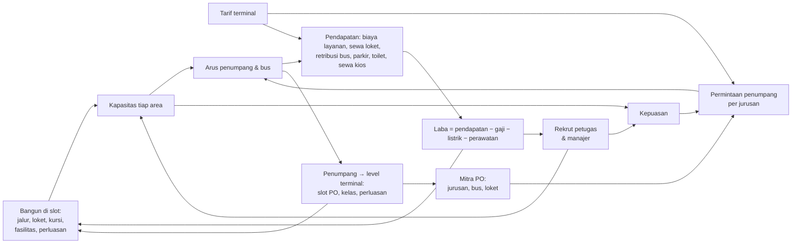

# 13 · Rancangan Tycoon: dari idle ke tycoon

> **Status: langkah 1 selesai (8 Oktober 2026)** di cabang `tycoon`: modul murni (`src/sim/bangunan.ts`, `petugas.ts`, `tarif.ts`, `operasi.ts`, `keuangan.ts`) dan kalibrasi lewat tes tempo. Game belum memakainya; rilis 0.2.0 (ekonomi mitra PO, dokumen 12) masih memakai konsep idle. Dokumen ini mengubah arah game menjadi **tycoon**: terminal tumbuh lewat bangunan dan petugas yang nyata, bukan level tahap yang naik tanpa batas.
>
> Angka di dokumen ini adalah hasil kalibrasi pertama (bagian 14), masih bisa digeser. Angka yang berlaku selalu yang di `EKONOMI.tycoon` (`src/config/economy.config.ts`).

## 1. Ringkasan

Pemain adalah pengelola terminal. Ia membangun halte, jendela loket, kursi, fasilitas, dan perluasan di **slot** denah yang sudah ada, merekrut petugas, menggandeng mitra PO, mengatur **tarif terminal**, lalu menjaga **laba bersih**: pendapatan dikurangi gaji, listrik, dan perawatan. Tidak ada level tahap, pengali milestone, maupun reset prestige. Terminal tumbuh secara fisik sampai Terpadu. Setelah itu tantangannya adalah mengelolanya dengan baik.



## 2. Keputusan

| # | Keputusan | Akibatnya di rancangan |
|---|---|---|
| 1 | Konsep **tycoon**, bukan idle. Panel Tahap dihapus | Kapasitas berasal dari bangunan & petugas (bagian 4–5) |
| 2 | Ada **biaya operasional**. Yang dikejar **laba bersih** | Gaji, listrik, perawatan dibayar terus. Terminal bisa rugi (bagian 6) |
| 3 | **Offline tetap menghasilkan**, paling lama 8 jam | Butuh Manajer Operasional. Laba offline = pendapatan × 60% − biaya penuh (bagian 9) |
| 4 | **Renovasi (prestige) dihapus** | Terminal tumbuh terus lewat perluasan. Ekspansi ke kota lain bisa jadi fitur nanti |
| 5 | **Skala uang realistis** | Rupiah wajar (ribuan sampai miliar), tanpa pengali ×2 dan angka 1e15 |
| 6 | **Berbasis slot** di denah tetap (usulan, mengikuti diskusi) | Tidak ada penempatan bebas. Jalur orang & bus tetap seperti sekarang |
| 7 | **Kas tidak bisa minus** | Biaya dibayar dari kas. Bila kas habis, petugas berhenti satu per satu. Tanpa utang (bagian 6.3) |
| 8 | **Tarif terminal**: PO mengatur harga tiketnya sendiri, pemain mengatur tarif terminal | Biaya layanan, sewa loket, retribusi bus, parkir, toilet, sewa kios (bagian 6.4). Pengaturan harga per PO × jurusan dihapus |

Keputusan dokumen 12 yang **tetap berlaku**: loket milik terminal disewa PO, level & kelas terminal dari penumpang, kontrak PO, perluasan lima tahap yang permanen dan bertingkat, proyek tetap berjalan saat offline.

## 3. Yang dihapus, diubah, dan dipertahankan

| Sistem | Sekarang (0.2.0, idle) | Tycoon |
|---|---|---|
| Tahap Peron / Loket / Keberangkatan | Level tanpa batas, biaya ×1,08–1,09 per level | **Dihapus.** Kapasitas dari halte, jendela loket, gerbang, petak, dan petugas |
| Milestone | Kapasitas ×2 di Lv 25/50/100/200 | **Dihapus** |
| Kepala (3) | Syarat penghasilan offline | **Dihapus.** Diganti Manajer Operasional & Manajer Kemitraan yang bergaji |
| Renovasi | Reset kapasitas, +10% pendapatan per poin | **Dihapus** |
| Bonus level terminal | +4% pendapatan per level | **Dihapus.** Level membuka slot PO, kelas, dan perluasan saja |
| Bonus kepuasan | +25% pendapatan | **Diubah.** Kepuasan menambah jumlah penumpang, bukan pengali uang |
| Permintaan | Relatif terhadap kapasitas (kapasitas naik → penumpang ikut naik) | **Diubah.** Pasar penumpang mutlak per jurusan. Membangun melebihi pasar hanya menambah biaya |
| Fasilitas | Berlevel, biaya eksponensial | **Diubah.** Unit di slot (kios, toko aula, toilet, lahan parkir, pos retribusi) dengan biaya perawatan |
| Jalur bus | Bonus kapasitas | **Inti kapasitas:** 1 jalur = 1 halte kedatangan + 1 gerbang keberangkatan |
| Modernisasi | Pengali kapasitas, sekali beli | **Tetap**, ditambah biaya perawatan. "Pengatur bus" menjadi peran petugas |
| Mitra PO | Level, loket, jurusan, kelas, reputasi, harga, kontrak | **Tetap**, kecuali harga. PO membayar sewa jendela loket & retribusi bus, dan punya **kepuasan mitra** (bagian 7.1) |
| Harga tiket | Diatur pemain per PO × jurusan (50–200%), tombol Saran | **Diganti tarif terminal** (bagian 6.4). Harga tiket = harga normal PO |
| Level & kelas terminal | XP = penumpang, kurva 4.500 × (L − 1)^3,2 | **Tetap**, kurva disesuaikan dengan arus realistis (bagian 8) |
| Perluasan | Lima tahap, proyek sehari terminal | **Tetap.** Biaya realistis, dan tiap tahap menambah slot |
| Boost iklan ×2, Bus Emas | Pengali & hadiah uang | **Tetap**, hadiahnya dihitung dari laba (bagian 10) |
| Target harian & tantangan | "Upgrade 10×", "upgrade 40×" | **Diubah:** laba, penumpang, kepuasan, bangun |
| Event, papan peringkat, cloud save | | **Tetap** |

## 4. Area & kapasitas

Arus penumpang dibatasi area yang paling sempit, sama seperti sekarang. Bedanya, kapasitas tiap area kini berasal dari benda yang dibangun:

```
arus = min(permintaan, peron, loket, keberangkatan, pangkalan)       (pnp per jam terminal)
peron          = halte kedatangan × 100 × (1 + 0,25 × petugas peron per halte) × modernisasi peron
loket          = Σ PO: min(permintaan PO, jendela PO × 50 × modernisasi loket)
keberangkatan  = gerbang × 150 × (1 + 0,25 × petugas gerbang per gerbang) × modernisasi keberangkatan
pangkalan      = petak bus × 25 pnp ÷ 0,75 jam                        (bus parkir, dicuci, menunggu jadwal)
```

Bila arus jam sibuk melebihi peron, keberangkatan, atau pangkalan, arus semua PO dipotong sebanding. Kursi ruang tunggu tidak membatasi arus; kursi masuk ke kepuasan (bagian 7).

### 4.1 Slot

| Area | Unit | Awal | Slot | Bertambah lewat |
|---|---|---|---|---|
| Jalur | 1 halte kedatangan + 1 gerbang keberangkatan | 1 | 5 | Perluasan 4 (Gedung Antarpulau, +2), 5 (+2) |
| Jendela loket | Disewa satu PO | 1 | 4 | Perluasan 1 (+2), 2 (+2), 3 (lantai 2, +4), 4 (aula kedua, +4), 5 (+4) |
| Blok kursi ruang tunggu | 60 kursi | 1 | 4 | Perluasan 3 (lantai 2, +4) |
| Petak parkir bus | Kelompok 5 petak (dibangun lewat perluasan) | 2 | 2 | Perluasan 2 (+2), 4 & 5 (dek +4 tiap tahap) |
| Kios ruang tunggu | Disewakan | 0 | 3 | |
| Toko aula (minimarket, apotek) | Disewakan | 0 | 2 | Perluasan 3 (food court) |
| Toilet | Blok | 0 | 1 | Perluasan 3 (+1) |
| Lahan parkir kendaraan | Baris | 0 | 1 | Perluasan 2 (baris kedua) |
| Pos retribusi | Pintu masuk bus | 0 | 1 | |
| Modernisasi | Sekali beli | | 6 | Seperti sekarang |

Di terminal awal (1 jalur, 1 jendela, 2 kelompok petak, satu PO berjurusan Jakarta), arusnya min(permintaan ±135, peron 100, loket 50, keberangkatan 150, pangkalan 333) = 50 pnp/jam. Loket menjadi yang paling lambat, sama seperti sekarang, jadi langkah pertama tutorial tetap "bangun loket". Setelah dua jendela, peron (100) yang paling lambat, sehingga petugas peron dan Jalur 2 langsung berguna. Pangkalan baru membatasi sekitar 300 pnp/jam (perluasan 2).

### 4.2 Bangun

| Unit | Biaya | Perawatan per hari |
|---|---|---|
| Jalur 2 / 3 / 4 / 5 | Rp 15 jt / 60 jt / 250 jt / 800 jt | Rp 500 rb per jalur |
| Jalur 6 / 7 / 8 / 9 | Rp 1,5 M / 2,5 M / 4 M / 6 M | Rp 500 rb per jalur |
| Jendela loket | Rp 2 jt, naik 25% per jendela | Rp 150 rb |
| Blok kursi | Rp 4 jt | Rp 50 rb |
| Kios | Rp 5 jt | Rp 100 rb |
| Minimarket, apotek | Rp 12 jt | Rp 250 rb |
| Toilet | Rp 8 jt | Rp 200 rb |
| Lahan parkir kendaraan | Rp 6 jt | Rp 100 rb |
| Pos retribusi | Rp 6 jt | Rp 100 rb |
| Modernisasi | Rp 10 jt (mesin tiket) – Rp 400 jt (gate otomatis) | 0,1% harganya |

- **Bongkar**: unit bisa dibongkar dengan pengembalian 30% biaya. Gunanya untuk mengurangi biaya perawatan bila salah bangun.
- **Jendela loket kosong** (tidak disewa PO) tidak melayani dan tidak membayar sewa, tapi tetap butuh perawatan.

## 5. Petugas

Petugas menggantikan Kepala. Mereka juga mengisi peran yang sudah terlihat di adegan (petugas gerbang, juru parkir, satpam, petugas kebersihan). Gaji dibayar terus selama terminal beroperasi. Terminal buka 24 jam, jadi satu **posisi** berarti tiga shift; gaji di tabel adalah gaji satu posisi per hari.

| Peran | Efek | Batas | Gaji per posisi per hari |
|---|---|---|---|
| Petugas peron | +25% kapasitas halte kedatangannya | 1 per halte | Rp 450 rb |
| Petugas gerbang | +25% kapasitas gerbangnya | 1 per gerbang | Rp 450 rb |
| Petugas kebersihan | Kebersihan: 1 orang per 150 pnp/jam | 2 per jalur + 2 | Rp 360 rb |
| Satpam | Keamanan: 1 orang per jalur | 2 per jalur | Rp 450 rb |
| Juru parkir | Tanpa juru parkir, pendapatan parkir kendaraan −50% | 1 per lahan | Rp 300 rb |
| Petugas toilet | Tanpa petugas, kebersihan toilet ikut turun | 1 per toilet | Rp 300 rb |
| Petugas retribusi | Tanpa petugas, pos retribusi hanya memungut separuh bus | 1 per pos | Rp 360 rb |
| Manajer Operasional | Syarat terminal beroperasi saat game ditutup (bagian 9) | 1 | Rp 1,5 jt |
| Manajer Kemitraan | Memperpanjang kontrak & mengisi jendela kosong otomatis (pengganti Kepala Kemitraan) | 1 | Rp 1,2 jt |

- Petugas **jendela loket** adalah pegawai PO. Terminal tidak membayarnya.
- Rekrut dan berhentikan tanpa biaya sekali bayar, supaya mengatur jumlah petugas mengikuti jam sibuk & musim terasa ringan. Gaji dihitung per detik.
- State menyimpan **urutan rekrut**, bukan jumlah: yang terakhir direkrut berhenti lebih dulu (bagian 6.3), dan bila bangunannya dibongkar, kelebihan petugasnya keluar mulai dari yang terbaru.

## 6. Uang: pendapatan, biaya, laba

### 6.1 Pendapatan

Semua tarif diatur pemain (bagian 6.4). Angka di bawah memakai tarif bawaan.

| Sumber | Rumus | Syarat |
|---|---|---|
| Biaya layanan terminal | 10% × harga tiket × penumpang | |
| Sewa jendela loket | Rp 250 rb per hari per jendela yang disewa PO | |
| Retribusi bus | Rp 20 rb per bus yang berangkat | Pos retribusi (tanpa petugasnya separuh) |
| Parkir kendaraan | Rp 5 rb × kendaraan pengantar (±30% penumpang) | Lahan parkir (kapasitas per baris) |
| Toilet | Rp 2 rb × pemakai (±25% penumpang) | Toilet |
| Sewa kios & toko | Rp 300 rb per hari per unit yang terisi | Kios / toko |

- **Harga tiket** ditetapkan PO sendiri: harga normal = Rp 60 rb × nilai jurusan × nilai kelas × 1,06^(level PO − 1). Contoh: Jakarta Ekonomi Rp 60 rb, Surabaya Eksekutif Rp 230 rb, Medan Sleeper Rp 1,5 jt. Penumpang membayar tiket + biaya layanan terminal.
- Di awal, satu penumpang menghasilkan ±Rp 6 rb biaya layanan (10% dari tiket Rp 60 rb). Pos retribusi menambah ±Rp 0,8 rb per penumpang (bus ±25 penumpang).
- **Modal awal** Rp 25 jt: cukup untuk jendela kedua, PO kedua, petugas, dan Jalur 2 di menit-menit pertama. Laba hari pertama ±Rp 30 jt (±Rp 1 jt per menit nyata).
- **Biaya daftar PO** dalam Rupiah: PO kedua Rp 3 jt, Lumpia Kilat Rp 12 jt, Bakpia Rasa Rp 40 jt, sampai Kopi Gayo Rp 10 M. PO hadiah kelas & event tetap gratis.

### 6.2 Biaya

| Pos | Rumus |
|---|---|
| Gaji | Jumlah posisi × gaji per hari (tabel 5) |
| Perawatan | Jumlah unit × perawatan per hari (tabel 4.2) |
| Listrik | Rp 600 rb per hari per jalur. Malam hari ×1,5 (lampu) |
| Gedung perluasan | Biaya operasional tiap tahap yang selesai (bagian 8) |

- Gaji, perawatan, dan listrik dikali kelas terminal: Tipe C 1 · B 1,25 · A 1,5 · Terpadu 2. Kenaikannya dibuat landai supaya naik kelas tidak terasa seperti hukuman.
- Semua dihitung per detik, tapi dilaporkan **per hari** (laporan keuangan, bagian 11).

### 6.3 Kas habis

- Kas tidak pernah minus. Pendapatan & biaya dihitung per detik, dan biaya dibayar dari kas.
- Bila kas Rp 0 dan biaya masih lebih besar dari pendapatan, gaji tidak terbayar. Petugas yang terakhir direkrut berhenti, satu orang per jam terminal, sampai biaya tertutup. Manajer berhenti paling akhir.
- Bila tidak ada petugas lagi dan perawatan masih belum tertutup, perawatan tertunda: kenyamanan & kebersihan turun sampai kas cukup lagi.
- Notifikasi memperingatkan lebih dulu (kas tinggal kurang dari sehari biaya), dengan saran: kurangi petugas, ubah tarif, atau bongkar unit yang tidak terpakai.

### 6.4 Tarif terminal

| Tarif | Bawaan | Rentang | Bila dinaikkan |
|---|---|---|---|
| Biaya layanan (% harga tiket) | 10% | 0–25% | Permintaan turun linear, lebih peka di kelas ekonomi; komponen harga di kepuasan turun |
| Sewa jendela loket (per hari) | Rp 250 rb | Rp 0–1 jt | Kepuasan mitra PO turun |
| Retribusi bus (per bus) | Rp 20 rb | Rp 0–60 rb | Kepuasan mitra PO turun |
| Parkir kendaraan | Rp 5 rb | Rp 0–20 rb | Lebih sedikit pengantar yang parkir; komponen harga di kepuasan turun |
| Toilet | Rp 2 rb | Rp 0–5 rb | Lebih sedikit pemakai; komponen harga di kepuasan turun |
| Sewa kios & toko (per hari) | Rp 300 rb | Rp 0–2 jt | Unit bisa kosong bila sewa melebihi nilai keramaiannya |

- Efek biaya layanan dibuat **linear** (× 1 + 0,5 × elastisitas segmen ÷ 1,5 × (1 − tarif ÷ bawaan)), bukan elastisitas harga total. Biaya layanan hanya bagian kecil dari harga tiket, sehingga dengan elastisitas harga total tarif maksimum hampir selalu paling untung. Sekarang tarif terbaik ±15% saat permintaan yang membatasi, lebih tinggi saat terminal sesak.
- Tiap tarif punya tombol **Saran**: tarif yang memaksimalkan laba saat ini, seperti saran harga 0.2.0.
- **Anti-curang** seperti 0.2.0: hadiah "N menit laba", target, rekor, dan offline dihitung dengan tarif bawaan, supaya tarif ekstrem sesaat tidak menggelembungkan hadiah.

## 7. Penumpang, permintaan, kepuasan

Model segmen 0.2.0 (PO × jurusan × kelas, persaingan, kejenuhan, reputasi) tetap dipakai. Ada dua perbedaan: permintaan kini **mutlak**, dan harga datang dari biaya layanan terminal, bukan harga per PO:

```
pasar_j        = 45 pnp/jam × peminat_j × pengali kelas terminal × daya tarik kepuasan × ritme jam
pengali kelas  = Tipe C 1 · B 1,3 · A 1,6 · Terpadu 2
daya tarik     = 0,6 + 0,8 × kepuasan
permintaan_ij  = pasar_j × bagian PO i (reputasi, persaingan, kejenuhan) × faktor biaya layanan (bagian 6.4)
```

Akibatnya:

- Membangun loket untuk PO yang permintaannya kecil tidak menambah penumpang.
- Menambah jurusan lewat PO baru, naik kelas, dan menjaga kepuasan adalah cara memperbesar pasar.

**Kepuasan** (0–100%) menggerakkan daya tarik (permintaan) dan reputasi PO:

| Komponen | Bobot | Dari |
|---|---|---|
| Kelancaran | 30% | Antrean: permintaan dibanding kapasitas tiap area |
| Kenyamanan | 20% | Kursi dibanding penumpang yang menunggu, modernisasi (AC, papan jadwal) |
| Kebersihan | 20% | Petugas kebersihan & petugas toilet dibanding arus |
| Keamanan | 10% | Satpam per jalur, terutama malam hari |
| Fasilitas | 10% | Toilet, kios, toko aula, lahan parkir |
| Harga | 10% | Biaya layanan, tarif parkir & toilet dibanding tarif bawaan |

### 7.1 Kepuasan mitra PO

Tiap PO punya kepuasan mitra (0–100%) terhadap terminal:

| Dari | Naik bila |
|---|---|
| Sewa jendela loket & retribusi bus | Tarifnya di bawah bawaan |
| Penumpang PO itu | Bus-busnya penuh |
| Jendela loket | Antrean di jendela PO itu pendek (jendela cukup) |
| Kepuasan terminal | Penumpang puas |

- Kontrak hanya diperpanjang bila kepuasan mitra ≥ 50%, termasuk oleh Manajer Kemitraan.
- PO baru hanya mau bergabung bila perkiraan kepuasan mitranya ≥ 50%.
- Reputasi PO tidak lagi turun karena harga (harga tiket di tangan PO), tapi masih mengikuti kepuasan penumpang & armada.

## 8. Progres

- **Level terminal** tetap dari penumpang yang diberangkatkan. Arus kini realistis (puluhan sampai ribuan pnp per jam terminal, bukan ratusan per detik), jadi kurvanya berubah: XP kumulatif level L = **50 × (L − 1)^2,75** penumpang. Tempo mendekati keputusan 6 dokumen 12 (Tipe B ±1,4 jam, Tipe A ±5,9 jam, Terpadu ±17 jam):

  | Level | 3 | 6 | 10 (Tipe B) | 20 (Tipe A) | 30 (Terpadu) |
  |---|---|---|---|---|---|
  | Penumpang kumulatif | 340 | 4,2 rb | 21 rb | 164 rb | 525 rb |
  | Waktu main aktif (pemain serakah) | ±3 menit | ±25 menit | ±1,6 jam | ±6,7 jam | ±14,8 jam |

- **Kelas terminal**, slot PO, dan kelas bus mengikuti level seperti 0.2.0.
- **Perluasan** tetap lima tahap pada Lv 3 / 6 / 10 / 20 / 30, dengan biaya Rp 20 jt / 80 jt / 250 jt / 800 jt / 3 M. Proyeknya tetap sehari terminal. Tiap tahap menambah slot (tabel 4.1), bukan pengali. Setelah selesai, gedungnya punya biaya operasional per hari: Rp 0,5 jt / 2 jt / 6 jt / 20 jt / 60 jt (menumpuk).
- **Laba** pemain serakah dengan tarif bawaan (dari tes tempo, bagian 14):

  | Saat | Laba per hari terminal (24 menit nyata) | Biaya ÷ pendapatan |
  |---|---|---|
  | Hari pertama | ±Rp 30 jt | ±16% |
  | Tipe B (hari ke-10) | ±Rp 110 jt | ±14% |
  | Tipe A (hari ke-22) | ±Rp 215 jt | ±20% |
  | Terpadu (hari ke-40–52) | ±Rp 320–360 jt | ±18–30% |

## 9. Offline

- Terminal hanya beroperasi saat game ditutup bila ada **Manajer Operasional**. Tanpa manajer, terminal tutup: tidak ada pendapatan dan tidak ada biaya.
- Dengan manajer, laba offline = pendapatan × 60% − biaya penuh, paling lama **8 jam**, cukup untuk semalam tidur. Bisa negatif bila petugasnya terlalu banyak. Popup "Selama kamu pergi…" menampilkan pendapatan, biaya, dan laba.
- Proyek perluasan tetap berjalan, dengan atau tanpa manajer (keputusan 8 dokumen 12).

## 10. Target, tantangan, penghargaan, event, iklan

- **Target harian**: penumpang (tetap) dan **laba bersih hari ini ≥ X**. "Upgrade 10×" dihapus.
- **Tantangan mingguan**: penumpang, laba bersih, dan kepuasan. "Upgrade 40×" dihapus.
- **Penghargaan**: yang berbasis level tahap (mis. `level100`) diganti, misalnya "5 jalur", "tanpa rugi 7 hari", "semua slot loket terisi", dan "Terpadu".
- **Hadiah "N menit pendapatan"** menjadi "N menit laba" (laba rata-rata per jam, paling sedikit nilai kecil supaya tetap terasa saat rugi).
- **Boost iklan** tetap: pendapatan ×2 selama 30 menit. Bus Emas tetap.
- **Event musiman** tetap: pasar penumpang naik (Mudik ×1,5, Nataru ×1,3, HUT RI ×1,17), jadi kapasitas & petugas tambahan terasa gunanya.

## 11. UI

- **Tab**: Bangun · Petugas · PO · Terminal · Target. Tab Tahap, Fasilitas, dan Modern digabung ke Bangun.
- **Bangun**: dikelompokkan per area (Peron & jalur, Loket, Ruang tunggu, Pangkalan, Fasilitas, Modernisasi). Tiap kartu menampilkan unit, jumlah/slot, efeknya pada area, biaya, perawatan, dan alasan bila belum bisa (mis. "slot penuh: Perluasan 2").
- **Petugas**: jumlah per peran dengan tombol − / +, efeknya, gaji, dan total gaji per hari.
- **PO**: pengaturan harga per jurusan dihapus. Kartu PO menampilkan harga tiket PO (informasi), kepuasan mitra, kontrak, dan jendela loketnya.
- **Terminal**: level & kelas, perluasan, **tarif** (dengan tombol Saran), dan **laporan keuangan** (hari ini & kemarin: pendapatan per sumber, biaya per pos, laba, kas).
- **HUD**: kas, laba hari ini (hijau/merah), arus, kepuasan, jam.
- **Adegan**: label area (PERON, LOKET, KEBERANGKATAN, PANGKALAN) bisa diketuk untuk membuka kartu Bangun area itu. Penanda "PALING LAMBAT" tetap ada di area yang membatasi arus.
- **Mode ringkas** hanya menyembunyikan panel. Rel chip tahap dihapus.

## 12. Adegan 3D

Sebagian besar sudah menggambarkan benda nyata: halte & gerbang per jalur, jendela loket per PO, kelompok parkir per tahap, kios & toko berpintu gulung, modernisasi, dan petugas statis. Yang perlu ditambah atau diubah:

- **Blok kursi** ruang tunggu muncul sesuai yang dibangun. Sekarang keempatnya selalu ada.
- **Petugas** terlihat sesuai yang direkrut: petugas peron per halte, petugas gerbang, kebersihan (siang juga, tidak hanya malam), satpam, juru parkir, petugas toilet, dan petugas retribusi.
- **Lahan parkir kendaraan** (baris 1, baris 2 di tahap 2) dan **pos retribusi** mengikuti yang dibangun.
- **Label area** bisa diketuk (bagian 11).

## 13. Save & rilis

- Skema save **3**. Belum ada pemain, jadi save 0.1/0.2 tidak dimigrasi: ekonomi dimulai baru, sedangkan nama terminal, profil, dan statistik sepanjang masa dipertahankan.
- `versiMinimal` dinaikkan ke versi rilis tycoon (mis. 0.3.0).

## 14. Kalibrasi & target tempo

Tempo untuk pemain aktif yang bermain optimal, diukur dengan pemain serakah (`tests/tycoon-sim.ts`, dijaga `tests/tycoon-tempo.test.ts`). Tiap jam terminal ia membeli aksi yang paling cepat balik modal (laba rata-rata jam sibuk & sepi). Perluasan dinilai dari aksi terbaik yang dibuka slot barunya.

| Momen | Target | Hasil kalibrasi |
|---|---|---|
| PO kedua | < 3 menit | menit ke-0 |
| Jalur 2 | 8–12 menit | menit ke-2 |
| Perluasan 1 dimulai | ±30 menit | menit ke-35 |
| Lv 6 | ±40 menit | menit ke-25 |
| Tipe B (Lv 10) | ±1,5 jam | 1,6 jam |
| Tipe A (Lv 20) | ±6 jam | 6,7 jam |
| Terpadu (Lv 30) | ±12–17 jam | 14,8 jam |
| Perluasan 5 selesai | | 16 jam |
| Jeda terlama tanpa membeli di jam pertama | | ±25 menit |
| Petugas berhenti karena kas habis | 0 | 0 |

Catatan kalibrasi:

- Percobaan pertama memperlihatkan **pangkalan** (10 petak, bus parkir 1,5 jam = 167 pnp/jam) menjadi tembok sebelum Jalur 2 berguna. Lama parkir bus diturunkan ke 0,75 jam.
- **Jendela loket** mentok 8 sampai perluasan 4 membuat Lv 10–20 sangat lambat. Perluasan 3 kini menambah 4 jendela (lantai 2).
- Di awal, **pasar** (bukan kapasitas) yang membatasi: dua jurusan ±150 pnp/jam. Barang awal dibuat lebih murah dan pasar Tipe C lebih besar, supaya keputusan bermakna muncul tiap 3–10 menit.
- **Biaya** awalnya hanya 5% pendapatan. Gaji kini per posisi tiga shift, perawatan & listrik dinaikkan. Pengali biaya per kelas sempat ×8 di Tipe A sehingga laba anjlok saat naik kelas; kini landai (1 → 2).
- **Akhir permainan** sempat mentok karena peron maksimal di 5 jalur. Perluasan 4 & 5 kini menambah jalur.
- Permintaan di akhir permainan masih ±1,6× kapasitas (kelancaran rendah). Biaya layanan yang lebih tinggi (bagian 6.4) dan Jalur 8–9 adalah jalan keluarnya; pemain serakah memakai tarif bawaan.

Tes unit modul murni: `tests/bangunan.test.ts`, `petugas.test.ts`, `tarif.test.ts`, `operasi.test.ts` (termasuk pasar mutlak: membangun melebihi permintaan tidak menambah arus), `keuangan.test.ts` (termasuk overbuild merugi dan kas tidak pernah minus). Tes offline menyusul bersama peralihan state (langkah 2).

## 15. Rencana implementasi bertahap

0. ✓ **Rancangan ini** + keputusan (bagian 2 & 16).
1. ✓ **Modul murni & kalibrasi** (`src/sim/bangunan.ts`, `petugas.ts`, `tarif.ts`, `operasi.ts`, `keuangan.ts`, blok `EKONOMI.tycoon`):
   - kapasitas area, pasar mutlak per jurusan, pendapatan & biaya, kas tidak minus;
   - harga tiket = harga normal PO, tarif terminal, kepuasan mitra PO;
   - kalibrasi lewat pemain serakah & tes tempo.
2. **Peralihan state & save**:
   - `GameState` memakai bangunan, petugas (urut rekrut), tarif, kas (Rupiah `number`), dan buku harian (pendapatan & biaya per hari);
   - aksi bangun / bongkar / rekrut / berhentikan / atur tarif; offline dengan Manajer Operasional;
   - hapus tahap, Kepala, Renovasi, milestone, bonus level, harga per PO;
   - save skema 3 & cloud save (ekonomi lama dimulai baru, profil tetap).
3. **UI**: tab Bangun / Petugas, tarif & laporan keuangan di tab Terminal, kartu PO tanpa harga per jurusan, HUD laba, popup offline baru; tab Tahap & rel chip dihapus.
4. **Adegan 3D**: blok kursi, petugas sesuai rekrutan, lahan parkir & pos retribusi, label area yang bisa diketuk, penanda bottleneck per area.
5. **Tutorial**, target harian, tantangan, penghargaan, notifikasi, analitik. Tutorial usulan:
   - bangun jendela loket;
   - daftarkan PO kedua;
   - rekrut petugas peron;
   - bangun Jalur 2.
6. **README & dokumen**, lalu rilis 0.3.0.

## 16. Keputusan terbuka

Sudah diputuskan (8 Oktober 2026): kas tidak bisa minus, tarif terminal, offline 8 jam (bagian 2).

1. **Harga tiket PO**: selalu harga normal, atau PO ikut menyesuaikan harga sendiri (mis. diskon saat sepi, naik saat musim mudik).
2. **Kota lain** (beberapa terminal): fitur jangka panjang, bukan bagian rilis tycoon pertama.
