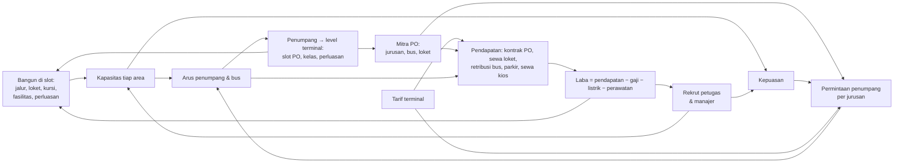

# 13 · Rancangan Tycoon: dari idle ke tycoon

> **Status: dirilis sebagai 0.3.0 (9 Oktober 2026)** di `main` & bustation.games. Langkah 1–6 selesai (bagian 15): modul murni & kalibrasi, `GameState`, save skema 3, UI lima tab, tutorial, target, tantangan, penghargaan, notifikasi, dan analitik memakai ekonomi tycoon, dan adegan 3D mengikuti bangunan & petugas (bagian 12). Belum: bentuk adegan bangunan bertingkat tahap 3–5, judul game (masih "Idle Bus"), dan keputusan terbuka bagian 16. Dokumen ini mengubah arah game menjadi **tycoon**: terminal tumbuh lewat bangunan dan petugas yang nyata, bukan level tahap yang naik tanpa batas.
>
> **Pembaruan sesudah 0.3.0 (9 Oktober 2026, di cabang `tycoon`, belum dirilis):** penumpang tidak lagi membayar terminal (biaya layanan & tarif toilet dihapus), pendapatan utama terminal kini **kontrak PO** yang dibayar di muka (bagian 6.5), dan tempo dikalibrasi ulang (bagian 14). Keputusan 9–16 di bagian 2.
>
> Angka di dokumen ini adalah hasil kalibrasi (bagian 14), masih bisa digeser. Angka yang berlaku selalu yang di `EKONOMI.tycoon` (`src/config/economy.config.ts`).

## 1. Ringkasan

Pemain adalah pengelola terminal. Ia membangun halte, jendela loket, kursi, fasilitas, dan perluasan di **slot** denah yang sudah ada, merekrut petugas, menggandeng mitra PO, mengatur **tarif terminal**, lalu menjaga **laba bersih**: pendapatan dikurangi gaji, listrik, dan perawatan. Tidak ada level tahap, pengali milestone, maupun reset prestige. Terminal tumbuh secara fisik sampai Terpadu. Setelah itu tantangannya adalah mengelolanya dengan baik.



## 2. Keputusan

| # | Keputusan | Akibatnya di rancangan |
|---|---|---|
| 1 | Konsep **tycoon**, bukan idle. Panel Tahap dihapus | Kapasitas berasal dari bangunan & petugas (bagian 4–5) |
| 2 | Ada **biaya operasional**. Yang dikejar **laba bersih** | Gaji, listrik, perawatan dibayar terus. Terminal bisa rugi (bagian 6) |
| 3 | **Offline tetap menghasilkan**, paling lama 8 jam | Butuh Manajer Operasional. Laba offline = (pendapatan + kontrak PO dirata-rata) × 60% − biaya penuh (bagian 9) |
| 4 | **Renovasi (prestige) dihapus** | Terminal tumbuh terus lewat perluasan. Ekspansi ke kota lain bisa jadi fitur nanti |
| 5 | **Skala uang realistis** | Rupiah wajar (ribuan sampai miliar), tanpa pengali ×2 dan angka 1e15 |
| 6 | **Berbasis slot** di denah tetap (usulan, mengikuti diskusi) | Tidak ada penempatan bebas. Jalur orang & bus tetap seperti sekarang |
| 7 | **Kas tidak bisa minus** | Biaya dibayar dari kas. Bila kas habis, petugas berhenti satu per satu. Tanpa utang (bagian 6.3) |
| 8 | **Tarif terminal**: PO mengatur harga tiketnya sendiri, pemain mengatur tarif terminal | Sewa loket, retribusi bus, parkir, sewa kios (bagian 6.4). Pengaturan harga per PO × jurusan dihapus |
| 9 | **Penumpang tidak membayar terminal** (9 Oktober 2026): biaya layanan & tarif toilet dihapus tanpa pengganti di sisi penumpang | Penumpang membayar harga tiket PO saja. Toilet & musholla gratis. Hanya parkir pengantar yang bertarif |
| 10 | **Kontrak PO dibayar di muka** | Saat PO bergabung & tiap perpanjangan, nilainya langsung masuk kas (bagian 6.5) |
| 11 | **Panjang kontrak ditawarkan PO** | 5–30 hari terminal, diundi menurut tingkat PO: PO kecil pendek, PO besar panjang |
| 12 | **Nilai kontrak ikut armada PO** | Tingkat PO, level PO, dan kelas terminal |
| 13 | **Biaya daftar PO dihapus** | Mendaftarkan PO gratis; batasnya slot PO & jendela |
| 14 | **Slot PO terus bertambah** seiring level terminal | Satu slot tiap 10 level setelah Lv 60, sampai 20 di Lv 140 |
| 15 | Loket menampilkan **"+N tiket"**, bukan "+Rp" | Uang tiket milik PO. N = tiket yang dibeli pembeli itu (dengan rombongannya) |
| 16 | HUD menampilkan **penumpang di terminal**, bukan arus | Penumpang yang sedang menunggu = arus × lama menunggu |

Keputusan dokumen 12 yang **tetap berlaku**: loket milik terminal disewa PO, level & kelas terminal dari penumpang, kontrak PO, perluasan lima tahap yang permanen dan bertingkat, proyek tetap berjalan saat offline.

## 3. Yang dihapus, diubah, dan dipertahankan

| Sistem | Sekarang (0.2.0, idle) | Tycoon |
|---|---|---|
| Tahap Peron / Loket / Keberangkatan | Level tanpa batas, biaya ×1,08–1,09 per level | **Dihapus.** Kapasitas dari halte, jendela loket, gerbang, petak, dan petugas |
| Milestone | Kapasitas ×2 di Lv 25/50/100/200 | **Dihapus** |
| Kepala (3) | Syarat penghasilan offline | **Dihapus.** Diganti Manajer Operasional & Manajer Kemitraan yang bergaji |
| Renovasi | Reset kapasitas, +10% pendapatan per poin | **Dihapus** |
| Bonus level terminal | +4% pendapatan per level | **Dihapus.** Level membuka slot PO, kelas, dan perluasan saja |
| Bonus kepuasan | +25% pendapatan | **Diubah.** Kepuasan menambah jumlah penumpang, bukan pengali uang |
| Permintaan | Relatif terhadap kapasitas (kapasitas naik → penumpang ikut naik) | **Diubah.** Pasar penumpang mutlak per jurusan. Membangun melebihi pasar hanya menambah biaya |
| Fasilitas | Berlevel, biaya eksponensial | **Diubah.** Unit di slot (kios, toko aula, toilet, lahan parkir, pos retribusi) dengan biaya perawatan |
| Jalur bus | Bonus kapasitas | **Inti kapasitas:** 1 jalur = 1 halte kedatangan + 1 gerbang keberangkatan |
| Modernisasi | Pengali kapasitas, sekali beli | **Tetap**, ditambah biaya perawatan. "Pengatur bus" menjadi peran petugas |
| Mitra PO | Level, loket, jurusan, kelas, reputasi, harga, kontrak | **Tetap**, kecuali harga. PO membayar **kontrak di muka** (bagian 6.5), sewa jendela loket & retribusi bus, dan punya **kepuasan mitra** (bagian 7.1) |
| Harga tiket | Diatur pemain per PO × jurusan (50–200%), tombol Saran | **Diganti tarif terminal** (bagian 6.4). Harga tiket = harga normal PO |
| Level & kelas terminal | XP = penumpang, kurva 4.500 × (L − 1)^3,2 | **Tetap**, kurva disesuaikan dengan arus realistis (bagian 8) |
| Perluasan | Lima tahap, proyek sehari terminal | **Tetap.** Biaya realistis, dan tiap tahap menambah slot |
| Boost iklan ×2, Bus Emas | Pengali & hadiah uang | **Tetap**, hadiahnya dihitung dari laba (bagian 10) |
| Target harian & tantangan | "Upgrade 10×", "upgrade 40×" | **Diubah:** laba, penumpang, kepuasan, bangun |
| Event, papan peringkat, cloud save | | **Tetap** |

## 4. Area & kapasitas

Arus penumpang dibatasi area yang paling sempit, sama seperti sekarang. Bedanya, kapasitas tiap area kini berasal dari benda yang dibangun:

```
arus = min(permintaan, peron, loket, keberangkatan, pangkalan)       (pnp per jam terminal)
peron          = halte kedatangan × 100 × (1 + 0,25 × petugas peron per halte) × modernisasi peron
loket          = Σ PO: min(permintaan PO, jendela PO × 50 × modernisasi loket)
keberangkatan  = gerbang × 150 × (1 + 0,25 × petugas gerbang per gerbang) × modernisasi keberangkatan
pangkalan      = petak bus × 25 pnp ÷ 0,75 jam                        (bus parkir, dicuci, menunggu jadwal)
```

Bila arus jam sibuk melebihi peron, keberangkatan, atau pangkalan, arus semua PO dipotong sebanding. Kursi ruang tunggu tidak membatasi arus; kursi masuk ke kepuasan (bagian 7).

### 4.1 Slot

| Area | Unit | Awal | Slot | Bertambah lewat |
|---|---|---|---|---|
| Jalur | 1 halte kedatangan + 1 gerbang keberangkatan | 1 | 5 | Perluasan 4 (Gedung Antarpulau, +2), 5 (+2) |
| Jendela loket | Disewa satu PO | 1 | 4 | Perluasan 1 (+2), 2 (+2), 3 (lantai 2, +4), 4 (aula kedua, +4), 5 (+4) |
| Blok kursi ruang tunggu | 60 kursi | 1 | 4 | Perluasan 3 (lantai 2, +4) |
| Petak parkir bus | Kelompok 5 petak (dibangun lewat perluasan) | 2 | 2 | Perluasan 2 (+2), 4 & 5 (dek +4 tiap tahap) |
| Kios ruang tunggu | Disewakan | 0 | 3 | |
| Toko aula (minimarket, apotek) | Disewakan | 0 | 2 | Perluasan 3 (food court) |
| Toilet | Blok | 0 | 1 | Perluasan 3 (+1) |
| Lahan parkir kendaraan | Baris | 0 | 1 | Perluasan 2 (baris kedua) |
| Pos retribusi | Pintu masuk bus | 0 | 1 | |
| Modernisasi | Sekali beli | | 6 | Seperti sekarang |

Di terminal awal (1 jalur, 1 jendela, 2 kelompok petak, satu PO berjurusan Jakarta), arusnya min(permintaan ±135, peron 100, loket 50, keberangkatan 150, pangkalan 333) = 50 pnp/jam. Loket menjadi yang paling lambat, sama seperti sekarang, jadi langkah pertama tutorial tetap "bangun loket". Setelah dua jendela, peron (100) yang paling lambat, sehingga petugas peron dan Jalur 2 langsung berguna. Pangkalan baru membatasi sekitar 300 pnp/jam (perluasan 2).

### 4.2 Bangun

| Unit | Biaya | Perawatan per hari |
|---|---|---|
| Jalur 2 / 3 / 4 / 5 | Rp 15 jt / 60 jt / 250 jt / 800 jt | Rp 500 rb per jalur |
| Jalur 6 / 7 / 8 / 9 | Rp 1,5 M / 2,5 M / 4 M / 6 M | Rp 500 rb per jalur |
| Jendela loket | Rp 2 jt, naik 25% per jendela | Rp 150 rb |
| Blok kursi | Rp 4 jt | Rp 50 rb |
| Kios | Rp 5 jt | Rp 100 rb |
| Minimarket, apotek | Rp 12 jt | Rp 250 rb |
| Toilet | Rp 8 jt | Rp 200 rb |
| Lahan parkir kendaraan | Rp 6 jt | Rp 100 rb |
| Pos retribusi | Rp 6 jt | Rp 100 rb |
| Modernisasi | Rp 10 jt (mesin tiket) – Rp 400 jt (gate otomatis) | 0,1% harganya |

- **Bongkar**: unit bisa dibongkar dengan pengembalian 30% biaya. Gunanya untuk mengurangi biaya perawatan bila salah bangun.
- **Jendela loket kosong** (tidak disewa PO) tidak melayani dan tidak membayar sewa, tapi tetap butuh perawatan.

## 5. Petugas

Petugas menggantikan Kepala. Mereka juga mengisi peran yang sudah terlihat di adegan (petugas gerbang, juru parkir, satpam, petugas kebersihan). Gaji dibayar terus selama terminal beroperasi. Terminal buka 24 jam, jadi satu **posisi** berarti tiga shift; gaji di tabel adalah gaji satu posisi per hari.

| Peran | Efek | Batas | Gaji per posisi per hari |
|---|---|---|---|
| Petugas peron | +25% kapasitas halte kedatangannya | 1 per halte | Rp 450 rb |
| Petugas gerbang | +25% kapasitas gerbangnya | 1 per gerbang | Rp 450 rb |
| Petugas kebersihan | Kebersihan: 1 orang per 150 pnp/jam | 2 per jalur + 2 | Rp 360 rb |
| Satpam | Keamanan: 1 orang per jalur | 2 per jalur | Rp 450 rb |
| Juru parkir | Tanpa juru parkir, pendapatan parkir kendaraan −50% | 1 per lahan | Rp 300 rb |
| Petugas toilet | Tanpa petugas, kebersihan toilet ikut turun | 1 per toilet | Rp 300 rb |
| Petugas retribusi | Tanpa petugas, pos retribusi hanya memungut separuh bus | 1 per pos | Rp 360 rb |
| Manajer Operasional | Syarat terminal beroperasi saat game ditutup (bagian 9) | 1 | Rp 1,5 jt |
| Manajer Kemitraan | Memperpanjang kontrak & mengisi jendela kosong otomatis (pengganti Kepala Kemitraan) | 1 | Rp 1,2 jt |

- Petugas **jendela loket** adalah pegawai PO. Terminal tidak membayarnya.
- Rekrut dan berhentikan tanpa biaya sekali bayar, supaya mengatur jumlah petugas mengikuti jam sibuk & musim terasa ringan. Gaji dihitung per detik.
- State menyimpan **urutan rekrut**, bukan jumlah: yang terakhir direkrut berhenti lebih dulu (bagian 6.3), dan bila bangunannya dibongkar, kelebihan petugasnya keluar mulai dari yang terbaru.

## 6. Uang: pendapatan, biaya, laba

### 6.1 Pendapatan

Semua tarif diatur pemain (bagian 6.4). Angka di bawah memakai tarif bawaan.

| Sumber | Rumus | Syarat |
|---|---|---|
| Kontrak PO | Dibayar di muka saat PO bergabung & tiap perpanjangan (bagian 6.5) | PO terdaftar |
| Sewa jendela loket | Rp 250 rb per hari per jendela yang disewa PO | |
| Retribusi bus | Rp 100 rb per bus yang berangkat | Pos retribusi (tanpa petugasnya separuh) |
| Parkir kendaraan | Rp 5 rb × kendaraan pengantar (±30% penumpang) | Lahan parkir (kapasitas per baris) |
| Sewa kios & toko | Rp 300 rb per hari per unit yang terisi | Kios / toko |

- **Harga tiket** ditetapkan PO sendiri: harga normal = Rp 60 rb × nilai jurusan × nilai kelas × 1,06^(level PO − 1). Contoh: Jakarta Ekonomi Rp 60 rb, Surabaya Eksekutif Rp 230 rb, Medan Sleeper Rp 1,5 jt. **Penumpang membayar tiket saja** (keputusan 9); uangnya milik PO. Toilet & musholla gratis.
- Sampai 0.3.0 penumpang juga membayar biaya layanan (10% tiket) dan toilet (Rp 2 rb), ±70–90% pendapatan terminal. Sebagai gantinya ada kontrak PO, dan retribusi dinaikkan dari Rp 20 rb ke Rp 100 rb per bus (±Rp 4 rb per penumpang, dibayar PO) supaya operasi terminal tetap berlaba di awal.
- **Modal awal** Rp 25 jt. Terminal baru tanpa fasilitas sedikit merugi (±Rp 1 jt per hari: perawatan & listrik melebihi sewa satu jendela). PO kedua langsung membayar kontraknya di muka, jadi barang awal (petugas, pos retribusi, lahan parkir, modernisasi pertama) terbeli di menit-menit pertama. Laba hari pertama ±Rp 25 jt (kontrak dirata-rata).
- **Biaya daftar PO** dihapus (keputusan 13): mendaftarkan PO gratis, PO-lah yang membayar.

### 6.2 Biaya

| Pos | Rumus |
|---|---|
| Gaji | Jumlah posisi × gaji per hari (tabel 5) |
| Perawatan | Jumlah unit × perawatan per hari (tabel 4.2) |
| Listrik | Rp 600 rb per hari per jalur. Malam hari ×1,5 (lampu) |
| Gedung perluasan | Biaya operasional tiap tahap yang selesai (bagian 8) |
| Kompensasi | Sisa nilai kontrak yang dikembalikan saat memutus PO (bagian 6.5) |

- Gaji, perawatan, dan listrik dikali kelas terminal: Tipe C 1 · B 1,25 · A 1,5 · Terpadu 2. Kenaikannya dibuat landai supaya naik kelas tidak terasa seperti hukuman.
- Semua dihitung per detik, tapi dilaporkan **per hari** (laporan keuangan, bagian 11).

### 6.3 Kas habis

- Kas tidak pernah minus. Pendapatan & biaya dihitung per detik, dan biaya dibayar dari kas.
- Bila kas Rp 0 dan biaya masih lebih besar dari pendapatan, gaji tidak terbayar. Petugas yang terakhir direkrut berhenti, satu orang per jam terminal, sampai biaya tertutup. Manajer berhenti paling akhir.
- Bila tidak ada petugas lagi dan perawatan masih belum tertutup, perawatan tertunda: kenyamanan & kebersihan turun sampai kas cukup lagi.
- Notifikasi memperingatkan lebih dulu (kas tinggal kurang dari sehari biaya), dengan saran: kurangi petugas, ubah tarif, atau bongkar unit yang tidak terpakai.

### 6.4 Tarif terminal

| Tarif | Bawaan | Rentang | Bila dinaikkan |
|---|---|---|---|
| Sewa jendela loket (per hari) | Rp 250 rb | Rp 0–1 jt | Kepuasan mitra PO turun |
| Retribusi bus (per bus) | Rp 100 rb | Rp 0–300 rb | Kepuasan mitra PO turun |
| Parkir kendaraan | Rp 5 rb | Rp 0–20 rb | Lebih sedikit pengantar yang parkir; komponen harga di kepuasan turun |
| Sewa kios & toko (per hari) | Rp 300 rb | Rp 0–2 jt | Unit bisa kosong bila sewa melebihi nilai keramaiannya |

- Biaya layanan (% harga tiket) & tarif toilet dihapus 9 Oktober 2026 (keputusan 9), begitu pula elastisitas permintaan terhadap harga: harga tiket di tangan PO dan selalu normal.
- Sewa jendela sengaja tetap kecil: bila sewanya jauh di atas perawatan jendela (mis. Rp 1 jt), membangun jendela melebihi permintaan selalu untung.
- Tiap tarif punya tombol **Saran**: tarif yang memaksimalkan laba saat ini, seperti saran harga 0.2.0.
- **Anti-curang** seperti 0.2.0: hadiah "N menit laba", target, rekor, dan offline dihitung dengan tarif bawaan, supaya tarif ekstrem sesaat tidak menggelembungkan hadiah.

### 6.5 Kontrak PO (9 Oktober 2026)

- **Bergabung gratis**; PO membayar kontrak pertamanya di muka. Kontrak pertama PO awal (Ondel-Ondel) sudah termasuk modal awal.
- **Panjang** ditawarkan PO (keputusan 11): 5 / 7 / 10 / 14 / 21 / 30 hari terminal, diundi tetap per PO & kontrak ke-berapa (tawaran tidak berubah saat game dimuat ulang) menurut bobot tingkatnya. Kontrak pertama PO hadiah (kelas & event) 14 hari.

  | Tingkat | 5 | 7 | 10 | 14 | 21 | 30 |
  |---|---|---|---|---|---|---|
  | Lokal | 3 | 4 | 2 | 1 | | |
  | Regional | 1 | 3 | 3 | 2 | 1 | |
  | Nasional | | 1 | 2 | 3 | 2 | 1 |
  | Premium | | | 1 | 2 | 3 | 2 |

- **Nilai** (keputusan 12) = Rp 7,5 jt × tingkat (Lokal 1 · Regional 1,6 · Nasional 2,6 · Premium 4) × 1,08^(level PO − 1) × kelas terminal (C 1 · B 1,5 · A 2,2 · Terpadu 3,2) × hari × potongan kontrak panjang (×1,05 / 1 / 0,96 / 0,92 / 0,87 / 0,82), dibulatkan ke tiga angka penting. Contoh: PO lokal Lv 1 di Tipe C, 7 hari = Rp 52,5 jt; PO nasional Lv 5 di Tipe A, 14 hari ≈ Rp 752 jt.
- **Perpanjangan**: PO menawarkan kontrak baru saat sisa kontraknya ≤ 3 hari; diterima → menyambung sisa yang lama, nilainya dibayar di muka. PO hanya menawarkan bila kepuasan mitranya ≥ 50% (dan syarat kepuasan PO premium terpenuhi). Manajer Kemitraan menerimanya otomatis saat tinggal sehari. PO terakhir selalu menerima tawarannya sendiri, supaya terminal tidak pernah tanpa PO.
- **Habis** tanpa diperpanjang: PO keluar, jendelanya kosong, riwayatnya disimpan.
- **Putus**: sisa nilai kontrak dikembalikan pro-rata sebagai **kompensasi** (kas harus cukup), reputasi −10, jeda 3 hari. PO terakhir tidak bisa diputus.
- **Laporan & hadiah**: buku harian mencatat kontrak pada hari diterima, jadi laba hari itu melonjak. Rata-rata sehari di laporan, hadiah "N menit laba", target tantangan laba, dan laba offline memakai nilai kontrak yang **dirata-rata** sepanjang kontraknya. Peringatan kas menipis memakai laba operasi tanpa kontrak, karena kontrak berikutnya bisa masih berhari-hari lagi.
- **Slot PO** terus bertambah (keputusan 14): 2 → 3 (Lv 3) → 4 (Lv 6) → 5 (Lv 10) → 6 (Lv 14) → 7 (Lv 20) → 8 (Lv 25) → 9 (Lv 30) → 10 (Lv 40) → … → 20 (Lv 140). Lebih dari 8 butuh aula kedua (perluasan 4).

## 7. Penumpang, permintaan, kepuasan

Model segmen 0.2.0 (PO × jurusan × kelas, persaingan, kejenuhan, reputasi) tetap dipakai. Bedanya, permintaan kini **mutlak**, dan harga tidak lagi memengaruhi permintaan: harga tiket di tangan PO, dan sejak 9 Oktober 2026 penumpang tidak membayar terminal:

```
pasar_j        = 45 pnp/jam × peminat_j × pengali kelas terminal × daya tarik kepuasan × ritme jam
pengali kelas  = Tipe C 1 · B 1,3 · A 1,6 · Terpadu 2
daya tarik     = 0,6 + 0,8 × kepuasan
permintaan_ij  = pasar_j × bagian PO i (reputasi, persaingan, kejenuhan)
```

Akibatnya:

- Membangun loket untuk PO yang permintaannya kecil tidak menambah penumpang.
- Menambah jurusan lewat PO baru, naik kelas, dan menjaga kepuasan adalah cara memperbesar pasar.

**Kepuasan** (0–100%) menggerakkan daya tarik (permintaan) dan reputasi PO:

| Komponen | Bobot | Dari |
|---|---|---|
| Kelancaran | 30% | Antrean: permintaan dibanding kapasitas tiap area |
| Kenyamanan | 20% | Kursi dibanding penumpang yang menunggu, modernisasi (AC, papan jadwal) |
| Kebersihan | 20% | Petugas kebersihan & petugas toilet dibanding arus |
| Keamanan | 10% | Satpam per jalur, terutama malam hari |
| Fasilitas | 10% | Toilet, kios, toko aula, lahan parkir |
| Harga | 10% | Tarif parkir dibanding tarif bawaan |

### 7.1 Kepuasan mitra PO

Tiap PO punya kepuasan mitra (0–100%) terhadap terminal:

| Dari | Naik bila |
|---|---|
| Sewa jendela loket & retribusi bus | Tarifnya di bawah bawaan |
| Penumpang PO itu | Bus-busnya penuh |
| Jendela loket | Antrean di jendela PO itu pendek (jendela cukup) |
| Kepuasan terminal | Penumpang puas |

- PO hanya menawarkan perpanjangan kontrak bila kepuasan mitra ≥ 50%, juga untuk Manajer Kemitraan (bagian 6.5).
- PO baru hanya mau bergabung bila perkiraan kepuasan mitranya ≥ 50%.
- Reputasi PO tidak lagi turun karena harga (harga tiket di tangan PO), tapi masih mengikuti kepuasan penumpang & armada.

## 8. Progres

- **Level terminal** tetap dari penumpang yang diberangkatkan. Arus kini realistis (puluhan sampai ribuan pnp per jam terminal, bukan ratusan per detik), jadi kurvanya berubah: XP kumulatif level L = **50 × (L − 1)^2,75** penumpang. Tempo mendekati keputusan 6 dokumen 12 (Tipe B ±1,4 jam, Tipe A ±5,9 jam, Terpadu ±17 jam):

  | Level | 3 | 6 | 10 (Tipe B) | 20 (Tipe A) | 30 (Terpadu) |
  |---|---|---|---|---|---|
  | Penumpang kumulatif | 340 | 4,2 rb | 21 rb | 164 rb | 525 rb |
  | Waktu main aktif (pemain serakah) | ±3 menit | ±32 menit | ±1,6 jam | ±6,3 jam | ±13,1 jam |

- **Kelas terminal**, slot PO, dan kelas bus mengikuti level seperti 0.2.0; slot PO kini terus bertambah (bagian 6.5).
- **Perluasan** tetap lima tahap pada Lv 3 / 6 / 10 / 20 / 30, dengan biaya Rp 20 jt / 80 jt / 250 jt / 800 jt / 3 M. Proyeknya tetap sehari terminal. Tiap tahap menambah slot (tabel 4.1), bukan pengali. Setelah selesai, gedungnya punya biaya operasional per hari: Rp 0,5 jt / 2 jt / 6 jt / 20 jt / 60 jt (menumpuk).
- **Laba** pemain serakah dengan tarif bawaan (dari tes tempo, bagian 14; kontrak PO dirata-rata sepanjang kontraknya):

  | Saat | Laba per hari terminal (24 menit nyata) | Biaya ÷ pendapatan |
  |---|---|---|
  | Hari pertama | ±Rp 25 jt | ±15% |
  | Tipe B (hari ke-10) | ±Rp 140 jt | ±16% |
  | Tipe A (hari ke-22) | ±Rp 205 jt | ±22% |
  | Terpadu (hari ke-40–43) | ±Rp 450–470 jt | ±23% |

  Kontrak PO ±50% pendapatan di awal dan ±75–80% di akhir permainan; sisanya operasi (retribusi, parkir, sewa).

## 9. Offline

- Terminal hanya beroperasi saat game ditutup bila ada **Manajer Operasional**. Tanpa manajer, terminal tutup: tidak ada pendapatan dan tidak ada biaya.
- Dengan manajer, laba offline = (pendapatan + nilai kontrak PO yang dirata-rata) × 60% − biaya penuh, paling lama **8 jam**, cukup untuk semalam tidur. Kontrak ikut dihitung karena ia pendapatan utama terminal: tanpanya laba offline akhir permainan minus. Sisa kontrak tidak berkurang selama pergi (jam terminal berhenti). Bisa negatif bila petugasnya terlalu banyak. Popup "Selama kamu pergi…" menampilkan pendapatan, biaya, dan laba.
- Jam terminal berhenti selama game ditutup, jadi pendapatan offline dihitung dari rata-rata hari biasa dengan tarif pemain, tapi tidak pernah melebihi hasil tarif bawaan: tarif ekstrem sesaat sebelum keluar tidak menggelembungkan laba offline.
- Kas tetap tidak minus: bila habis, petugas berhenti satu per satu seperti bagian 6.3 dan biayanya ikut turun. Bila Manajer Operasional ikut berhenti, terminal tutup untuk sisa waktunya. Popup menyebut petugas yang berhenti.
- Proyek perluasan tetap berjalan, dengan atau tanpa manajer (keputusan 8 dokumen 12).

## 10. Target, tantangan, penghargaan, event, iklan

- **Target harian**: penumpang (tetap) dan **laba bersih hari ini ≥ X** (X dari laba operasi; kontrak PO yang diterima hari itu ikut menambah kemajuannya). "Upgrade 10×" dihapus.
- **Tantangan mingguan**: tiga dari empat jenis diundi tiap minggu: penumpang, laba bersih, kepuasan ≥ 75% selama 60 menit main, dan bangun 15 unit atau modernisasi. "Upgrade 40×" dihapus.
- **Penghargaan**: yang berbasis level tahap (mis. `level100`) diganti. Kini 20 penghargaan (`PENCAPAIAN_IDS`), antara lain petugas pertama, Manajer Operasional, lima jalur, tujuh hari tanpa rugi, kas Rp 1 M, aula loket penuh, dan Terpadu.
- **Hadiah "N menit pendapatan"** menjadi "N menit laba": laba rata-rata per jam hari biasa dengan tarif bawaan, termasuk kontrak PO yang dirata-rata, paling sedikit Rp 200 rb per menit supaya tetap terasa saat rugi.
- **Boost iklan** tetap: pendapatan ×2 selama 30 menit (kontrak PO tidak ikut). Bus Emas tetap.
- **Event musiman** tetap: pasar penumpang naik (Mudik ×1,5, Nataru ×1,3, HUT RI ×1,17), jadi kapasitas & petugas tambahan terasa gunanya.

## 11. UI

- **Tab**: Bangun · Petugas · PO · Terminal · Target. Tab Tahap, Fasilitas, dan Modern digabung ke Bangun.
- **Bangun**: dikelompokkan per area (Peron & jalur, Loket, Ruang tunggu, Pangkalan, Fasilitas, Modernisasi). Tiap kartu menampilkan unit, jumlah/slot, efeknya pada area, biaya, perawatan, dan alasan bila belum bisa (mis. "slot penuh: Perluasan 2").
- **Petugas**: jumlah per peran dengan tombol − / +, efeknya, gaji, dan total gaji per hari.
- **PO**: pengaturan harga per jurusan dihapus. Kartu PO menampilkan harga tiket PO (informasi), kepuasan mitra, kontrak, dan jendela loketnya. Tombol perpanjang berisi tawaran PO ("Perpanjang N hari" & nilainya) dan baru muncul saat sisa kontrak ≤ 3 hari; keterangan putus menyebut kompensasinya. PO tersedia urut katalog, tiap baris berisi tawaran kontraknya.
- **Terminal**: level & kelas, perluasan, **tarif** (dengan tombol Saran), dan **laporan keuangan** (hari ini & kemarin: pendapatan per sumber, biaya per pos, laba, kas).
- **HUD**: kas, laba hari ini (hijau/merah), penumpang di terminal (keputusan 16), kepuasan, jam.
- **Adegan**: label area (PERON, LOKET, KEBERANGKATAN, PANGKALAN) bisa diketuk untuk membuka kartu Bangun area itu. Area yang membatasi arus ditandai sorotan lantai merah berdenyut; label teks "PALING LAMBAT" dihapus atas permintaan user (9 Oktober 2026).
- **Mode ringkas** hanya menyembunyikan panel. Rel chip tahap dihapus.
- **Layar penuh** (9 Oktober 2026, permintaan user): panel bisa menutupi adegan karena tab yang berisi banyak pengaturan terlalu sempit di bawah adegan. Adegan berhenti digambar selama itu dan kameranya tidak berubah.
- Semua di atas sudah diterapkan (langkah 3); label area yang bisa diketuk menyusul di langkah 4 (bagian 12). Label PANGKALAN hanya muncul saat pangkalan yang paling lambat, karena di sana sudah ada papan "PANGKALAN BUS".

## 12. Adegan 3D

Sebagian besar sudah menggambarkan benda nyata: halte & gerbang per jalur, jendela loket per PO, kelompok parkir per tahap, kios & toko berpintu gulung, modernisasi, dan petugas statis. Yang perlu ditambah atau diubah:

- **Blok kursi** ruang tunggu muncul sesuai yang dibangun. Sekarang keempatnya selalu ada.
- **Petugas** terlihat sesuai yang direkrut: petugas peron per halte, petugas gerbang, kebersihan (siang juga, tidak hanya malam), satpam, juru parkir, petugas toilet, dan petugas retribusi.
- **Lahan parkir kendaraan** (baris 1, baris 2 di tahap 2) dan **pos retribusi** mengikuti yang dibangun.
- **Label area** bisa diketuk (bagian 11).

Yang sudah ikut langkah 2: lencana "K" dihapus dari label area, sorotan area yang membatasi arus jam sibuk mengikuti `bottleneckState`, penjaga kios & toko hadir per unit yang dibangun, dan juru parkir, petugas toilet, serta petugas retribusi hanya hadir bila bangunannya ada **dan** petugasnya direkrut. Efek "+Rp" memetakan enam sumber pendapatan ke empat tempat transaksi (loket, bus parkir, lorong parkir, kios/toko); "+Rp" sewa kios harian dihapus. Sejak 9 Oktober 2026 loket menampilkan "+N tiket" (keputusan 15), dan "+Rp" tinggal tiga sumber: retribusi (bus parkir), parkir (lorong parkir), dan sewa kios & toko (kios/toko).

Langkah 4 (9 Oktober 2026; logika murni di `src/game/fasilitas-adegan.ts`, posisi di `tata-letak.ts`):

- **Blok kursi** terpasang sebanyak unit kursi (paling banyak empat di adegan; unit lantai 2 belum digambar), mulai dari blok terdekat gerbang Jalur 1. Penumpang memilih kursi di blok terpasang dulu; bila penuh, ia **berdiri** menunggu di lantai blok yang belum dipasang, jadi kursi yang kurang terlihat (dan loket tidak tertahan).
- **Petugas** sebanyak yang direkrut: petugas peron di tepi peron tiap halte, petugas gerbang di tiap gerbang (urut jalur), satpam di empat pos (luar yang berpatroli malam, aula, peron keberangkatan, peron kedatangan), dan petugas kebersihan siang & malam di empat rute sapu (aula, ruang tunggu, peron, plaza). Sisanya bertugas di luar pandangan.
- **Parkir**: baris mobil pertama (beserta deret motor) terisi setelah lahan parkir pertama, baris kedua setelah lahan parkir kedua; tanpa lahan parkir tidak ada calon penumpang dari parkir. **Pos retribusi** muncul setelah dibangun.
- **Kios & toko per unit**: kios ruang tunggu urut KOPI, ROTI & KUE, OLEH-OLEH; toko aula urut minimarket lalu apotek. Yang belum dibangun tertutup rolling door dan tidak didatangi. Toilet & musholla baru didatangi setelah toilet dibangun.
- **Label area** berpanah "›" bisa diketuk: membuka tab Bangun di bagian area itu (Peron & Keberangkatan → jalur, Loket → jendela, Pangkalan → petak bus) dan menyorot barisnya. Zona Pangkalan ikut disorot saat paling lambat.

## 13. Save & rilis

- Skema save **3**. Belum ada pemain, jadi save 0.1/0.2 tidak dimigrasi (`migrasiKeV3`): ekonomi dimulai baru, dan hanya profil (nama terminal & persetujuan papan peringkat) serta benih cuaca yang dibawa. Statistik ikut mulai dari nol, karena uang idle tidak sebanding dengan Rupiah tycoon dan jam terminal kembali ke Senin 06.00.
- `versiMinimal` dinaikkan ke versi rilis tycoon (mis. 0.3.0).
- Papan peringkat: batas kenaikan skor di server kini 100 penumpang per detik main (`ARUS_WAJAR_MAKS`, terminal terbesar ±26). Server ikut `npm run deploy:web`, dan klien lama dipaksa memperbarui lewat `versiMinimal`.

## 14. Kalibrasi & target tempo

Tempo untuk pemain aktif yang bermain optimal, diukur dengan pemain serakah (`tests/tycoon-sim.ts`, dijaga `tests/tycoon-tempo.test.ts`). Tiap jam terminal ia membeli aksi yang paling cepat balik modal (laba rata-rata jam sibuk & sepi). Perluasan dinilai dari aksi terbaik yang dibuka slot barunya.

Hasil kalibrasi ulang 9 Oktober 2026 (kontrak PO); dalam kurung hasil 0.3.0:

| Momen | Target | Hasil kalibrasi |
|---|---|---|
| PO kedua | < 3 menit | menit ke-0 (0) |
| Perluasan 1 dimulai | < 45 menit | menit ke-3 (35) |
| Jalur 2 | < 30 menit | menit ke-27 (2) |
| Lv 6 | 15–45 menit | menit ke-32 (25) |
| Tipe B (Lv 10) | 75–130 menit | 1,6 jam (1,6) |
| Tipe A (Lv 20) | 5–8,5 jam | 6,3 jam (6,7) |
| Terpadu (Lv 30) | 12–17,5 jam | 13,1 jam (14,8) |
| Perluasan 5 selesai | sebelum 17,5 jam | 13,6 jam (16) |
| Jeda terlama tanpa membeli di jam pertama | ≤ 25 menit | 24 menit (±25) |
| Petugas berhenti karena kas habis | 0 | 0 |

Catatan kalibrasi:

- Percobaan pertama memperlihatkan **pangkalan** (10 petak, bus parkir 1,5 jam = 167 pnp/jam) menjadi tembok sebelum Jalur 2 berguna. Lama parkir bus diturunkan ke 0,75 jam.
- **Jendela loket** mentok 8 sampai perluasan 4 membuat Lv 10–20 sangat lambat. Perluasan 3 kini menambah 4 jendela (lantai 2).
- Di awal, **pasar** (bukan kapasitas) yang membatasi: dua jurusan ±150 pnp/jam. Barang awal dibuat lebih murah dan pasar Tipe C lebih besar, supaya keputusan bermakna muncul tiap 3–10 menit.
- **Biaya** awalnya hanya 5% pendapatan. Gaji kini per posisi tiga shift, perawatan & listrik dinaikkan. Pengali biaya per kelas sempat ×8 di Tipe A sehingga laba anjlok saat naik kelas; kini landai (1 → 2).
- **Akhir permainan** sempat mentok karena peron maksimal di 5 jalur. Perluasan 4 & 5 kini menambah jalur.
- Permintaan di akhir permainan masih ±1,6× kapasitas (kelancaran rendah). Jalur 8–9 adalah jalan keluarnya; pemain serakah memakai tarif bawaan.

Kalibrasi ulang 9 Oktober 2026 (penumpang tidak membayar, kontrak PO):

- Tanpa biaya layanan & toilet terminal kehilangan ±70–90% pendapatannya: terminal baru merugi dan kemajuan hampir berhenti. Kontrak PO menggantikannya.
- Pemain serakah menilai aksi dengan laba rata-rata **termasuk kontrak yang dirata-rata**, ditambah nilai jangka panjang penumpang (2,5 × nilai kontrak per penumpang), karena penumpang menaikkan level PO & terminal yang menaikkan kontrak berikutnya. Tanpa itu ia menimbun kas dan kurang membangun kapasitas. Aksi gratis yang sama cepat balik modalnya (mis. PO baru) dipilih yang tambahan nilainya terbesar.
- Kontrak besar di menit 0 membuat semua barang awal terbeli sekaligus. Bila nilai dasar terlalu besar (Rp 9 jt) pemain serakah juga membeli e-Tiket Rp 80 jt lalu tidak bisa membeli apa pun ±45 menit. Rp 6,5–8,5 jt aman, dipakai Rp 7,5 jt.
- Retribusi dinaikkan ke Rp 100 rb per bus supaya operasi tanpa kontrak tetap berlaba di awal (±Rp 12 jt per hari) dan laba offline bermakna. Sewa jendela tetap Rp 250 rb (bagian 6.4).
- Laba harian di tes tempo memakai kontrak yang dirata-rata (seperti laporan rata-rata & hadiah), karena kontrak yang dibayar di muka membuat laba kas per hari naik-turun tajam.
- Strategi wajar menyisakan kas untuk kerugian operasi sampai tawaran perpanjangan berikutnya. Tanpa itu, setelah membeli Jalur 6 di akhir permainan, kas habis sebelum kontrak berikutnya dan petugas berhenti.
- Jalur 2 kini menit ke-27 (patokan lama 8–12 menit): PO terbaik yang didaftarkan di menit 0 menyewa tiga jendela, sehingga loket, bukan jalur, yang membatasi sampai perluasan 1 selesai. Jeda terpanjang di jam pertama (±24 menit) adalah lama proyek perluasan. Pemain yang mengikuti tutorial tetap membangun Jalur 2 di menit-menit pertama.

Tes unit modul murni: `tests/bangunan.test.ts`, `petugas.test.ts`, `tarif.test.ts`, `operasi.test.ts` (termasuk pasar mutlak: membangun melebihi permintaan tidak menambah arus), `keuangan.test.ts` (termasuk overbuild merugi dan kas tidak pernah minus). Tes offline (Manajer Operasional, batas 8 jam, jam mundur, tarif ekstrem tidak menggelembungkan laba offline, kas habis) ada di `tests/state.test.ts` sejak langkah 2.

## 15. Rencana implementasi bertahap

0. ✓ **Rancangan ini** + keputusan (bagian 2 & 16).
1. ✓ **Modul murni & kalibrasi** (`src/sim/bangunan.ts`, `petugas.ts`, `tarif.ts`, `operasi.ts`, `keuangan.ts`, blok `EKONOMI.tycoon`):
   - kapasitas area, pasar mutlak per jurusan, pendapatan & biaya, kas tidak minus;
   - harga tiket = harga normal PO, tarif terminal, kepuasan mitra PO;
   - kalibrasi lewat pemain serakah & tes tempo.
2. ✓ **Peralihan state & save**:
   - `GameState` memakai bangunan, petugas (urut rekrut), tarif, kas (Rupiah `number`), dan buku harian (pendapatan & biaya per hari);
   - aksi bangun / bongkar / rekrut / berhentikan / atur tarif; offline dengan Manajer Operasional;
   - hapus tahap, Kepala, Renovasi, milestone, bonus level, harga per PO;
   - save skema 3 & cloud save (ekonomi lama dimulai baru, profil tetap).
3. ✓ **UI**: tab Bangun / Petugas, tarif & laporan keuangan di tab Terminal, kartu PO tanpa harga per jurusan, HUD laba, popup offline baru; tab Tahap & rel chip dihapus. Dikerjakan bersama langkah 2 supaya game tetap bisa dikompilasi.
4. ✓ **Adegan 3D**: blok kursi (penumpang berdiri bila kursi kurang), petugas peron, gerbang, kebersihan, & satpam sesuai rekrutan, lahan parkir & pos retribusi, kios & toko per unit, label area yang bisa diketuk, zona Pangkalan (bagian 12). Bangunan bertingkat tahap 3–5 (lantai 2, gedung parkir, Terpadu) masih di luar langkah ini.
5. ✓ **Tutorial**, target harian, tantangan, penghargaan, notifikasi, analitik. Tutorial (sesuai usulan):
   - bangun jendela loket;
   - daftarkan PO kedua;
   - rekrut petugas peron;
   - bangun Jalur 2.
6. ✓ **README & dokumen**, lalu **rilis 0.3.0** (9 Oktober 2026):
   - `version` 0.3.0 di `package.json`, `catatan` baru dan `versiMinimal` 0.3.0 di `src/config/rilis.config.ts`;
   - `tycoon` digabung ke `main` lalu `npm run deploy:web`; `npm run cap:sync` sebelum build APK berikutnya;
   - judul "Bustation: Idle Bus" sengaja belum diubah (nama, `index.html`, manifest PWA, og-image): menunggu keputusan.

7. **Pembaruan ekonomi** (9 Oktober 2026, sesudah 0.3.0; belum dirilis): biaya layanan & toilet dihapus, kontrak PO dibayar di muka (bagian 6.5), slot PO terus bertambah, "+N tiket" di loket, penumpang di terminal di HUD, panel layar penuh, dan kalibrasi ulang (bagian 14). Save skema 3 tetap; PO dari save 0.3.0 dianggap berkontrak 7 hari yang sudah dibayar.

## 16. Keputusan terbuka

Sudah diputuskan (8 Oktober 2026): kas tidak bisa minus, tarif terminal, offline 8 jam (bagian 2).

1. **Harga tiket PO**: selalu harga normal, atau PO ikut menyesuaikan harga sendiri (mis. diskon saat sepi, naik saat musim mudik).
2. **Kota lain** (beberapa terminal): fitur jangka panjang, bukan bagian rilis tycoon pertama.
